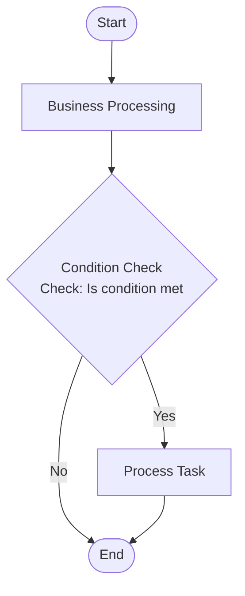

<div align="center">

# Ocean

**CLI Agent Asset & Capability Visualization Management Platform**

A desktop application built with Electron + React + TypeScript that uses Markdown files as the core data carrier, providing unified management and visual orchestration for CLI Agent (e.g., Claude Code) assets including agents, commands, abilities, knowledge bases, workflows, and more.

[English](./README.md) | [中文](./README_CN.md)

</div>

---

## Features

- **Local-First** - All data is stored as Markdown files in the local `.claude/` directory, giving you full control over your data
- **Visual Editing** - Professional flowchart editing powered by `@xyflow/react` with drag-and-drop, connection, undo/redo support
- **Knowledge Graph** - Build knowledge graphs based on WikiLink reference relationships with force-directed layout visualization
- **Multi-dimensional References** - Support both `@mention` and `[[WikiLink]]` syntax to establish associations between business entities
- **Markdown-First** - All business data stored as `.md` files, easy for version control and human-AI collaboration
- **Dual Environment** - Electron desktop app + browser preview for flexible adaptation
- **Mermaid Diagrams** - Render Mermaid flowcharts, sequence diagrams, class diagrams, and more within Markdown
- **Agentic Creation** - Auto-generate ability documents via AI Agent, simplifying content creation
- **LLM Configuration** - Provider settings support custom model parameters (temperature, max tokens, etc.)
- **Live File Loading** - Workflow details and other content loaded from local files in real-time

---

## Modules

Ocean includes eight core business modules and one settings module, each with data stored independently as Markdown files:

| Module | Directory | File Types | Description |
|--------|-----------|------------|-------------|
| **Agents** | `.claude/agents/` | `sub-agent`, `mcp` | AI agent configuration and role definitions |
| **Commands** | `.claude/commands/` | `command` | Executable commands and slash instructions |
| **Abilities** | `.claude/abilities/` | `ability` | AI capability unit definitions with LLM creation & optimization |
| **Skills** | `.claude/skills/` | `skill` | Reusable skill definitions with scripts/references/examples resources |
| **Knowledge** | `.claude/knowledges/` | `knowledge` | Business knowledge base management with Agentic auto-creation |
| **Workflows** | `.claude/workflows/` | `workflow` | Visual process definition and orchestration with local node folders |
| **Nodes** | `.claude/nodes/` | `business`, `process` | Workflow node template definitions |
| **Resources** | `.claude/resources/` | `rule`, `reference`, `tool` | Rules, reference docs, and tool descriptions |
| **Settings** | Config files | JSON | LLM providers, CLI Agent, Agentic mode, ability/skill/knowledge config |

### Workflow Node Types

The flow editor supports six node types:

| Node Type | Color | Description |
|-----------|-------|-------------|
| Start Node | Green | Workflow entry point |
| Process Node | Blue | General processing step with inline task editing |
| Decision Node | Yellow | Conditional branching with custom branch configuration |
| Business Node | Purple | References global node templates, carries complex business logic |
| Local Node | Blue | Workflow-private node, content stored in workflow directory |
| End Node | Red | Workflow exit point |

### Settings Module

The settings module provides global configuration management with five categories:

| Category | Description |
|----------|-------------|
| **LLM Providers** | Manage multiple LLM API providers (OpenAI/Anthropic/Azure/Custom), with connection testing and model parameter configuration |
| **Agentic Mode** | Configure AI Agent autonomous execution mode, supporting 7 tools (file read/write/edit/search/terminal), with iteration limit and timeout |
| **Ability Config** | Configure prompt templates for ability LLM creation and optimization |
| **Skill Config** | Configure global settings for skills |
| **Knowledge Config** | Configure global settings for knowledge base Agentic creation |

---

## Tech Stack

| Layer | Technology |
|-------|-----------|
| Framework | React 19 |
| Build Tool | Vite 5 |
| Language | TypeScript 5 |
| State Management | Zustand 5 |
| Flow Engine | @xyflow/react 12 |
| Desktop | Electron 40 |
| Styling | Tailwind CSS 3 |
| Animation | framer-motion 12 |
| Icons | lucide-react |
| Markdown Rendering | react-markdown + remark-gfm |
| Code Editor | @uiw/react-codemirror |
| Knowledge Graph | react-force-graph-2d + d3-force |
| Diagrams | mermaid |

---

## Getting Started

### Prerequisites

- Node.js >= 18.0.0
- pnpm >= 8.0.0

### Install

```bash
pnpm install
```

### Development

#### Option 1: Electron Desktop (Recommended)

Start Vite dev server and Electron app together with hot reload:

```bash
pnpm electron:dev
```

This will:
1. Start the Vite dev server (default port 5173)
2. Wait for Vite to be ready, then launch Electron
3. Auto-open DevTools

#### Option 2: Web Dev Server Only

```bash
pnpm dev
```

Then open `http://localhost:5173` in your browser.

#### Option 3: Preview Built Electron App

```bash
pnpm build
pnpm electron:preview
```

### Build

```bash
# Build frontend assets
pnpm build

# Build Electron main process
pnpm build:electron

# Package desktop app (output to release/)
pnpm electron:build
```

---

## Project Structure

```
ocean/
├── electron/                   # Electron main process
│   ├── launch.cjs             # Dev environment launcher (CJS)
│   └── preload.dev.cjs        # Dev environment preload script
├── src/
│   ├── components/
│   │   ├── ability/           # Ability module
│   │   ├── agent/             # Agent module
│   │   ├── command/           # Command module
│   │   ├── flow/              # Flow editor
│   │   │   ├── FlowCanvas.tsx
│   │   │   ├── FlowToolbar.tsx
│   │   │   ├── NodePanel.tsx
│   │   │   ├── PropertiesPanel.tsx
│   │   │   └── nodes/         # Node components
│   │   ├── knowledge/         # Knowledge module
│   │   ├── layout/            # Layout components
│   │   ├── node/              # Node management
│   │   ├── resource/          # Resource files
│   │   ├── settings/          # Settings (LLM, Agentic, CLI Agent, etc.)
│   │   ├── skill/             # Skill module
│   │   ├── ui/                # Shared UI components
│   │   │   ├── MarkdownEditor/
│   │   │   └── MarkdownRenderer/
│   │   └── workflow/          # Workflow module
│   ├── pages/                 # Page components
│   ├── stores/                # Zustand state stores
│   ├── types/                 # TypeScript type definitions
│   ├── utils/                 # Utility functions
│   └── hooks/                 # React hooks
├── dist/                      # Web build output
├── dist-electron/             # Electron build output
└── release/                   # Packaged applications
```

---

## Data Storage

### Storage Directory

All business data is stored as Markdown files in the `.claude/` hidden directory at the project root:

```
project-root/
└── .claude/
    ├── agents/        # Agent files (*.md)
    ├── commands/      # Command files (*.md)
    ├── abilities/     # Ability files (*.md)
    ├── knowledges/    # Knowledge files (*.md)
    ├── workflows/     # Workflow files (*.md)
    │   └── {workflow}/
    │       └── nodes/ # Workflow local nodes (*.md)
    ├── nodes/         # Global node definition files (*.md)
    ├── resources/     # Resource files (*.md)
    └── skills/        # Skill files (*.md)
        └── {skill}/
            ├── SKILL.md      # Skill main file
            ├── scripts/      # Script files
            ├── references/   # Reference files
            └── examples/     # Example files
```

### Markdown Format

All business entities use YAML Frontmatter for metadata:

```markdown
---
name: Example Agent
description: An AI agent
model: haiku
color: blue
---

# Agent Content

Detailed description here...
```

### Workflow Markdown Example

```markdown
---
type: workflow
name: Example Workflow
description: This is an example workflow
---

# Example Workflow

## Description
- This is an example workflow

## Input Materials
- Input 1
- Input 2

## Output Products
- Output 1

## Process



## Nodes

| Node Name | Execution Content |
|-----------|-------------------|
| Business Processing | `.claude/nodes/BusinessProcessing.md` |
| Process Task | `Task description content` |

## Mandatory Requirements
- Must create a `TodoList` to track the entire `process`
- Must strictly follow the `process` execution, skipping any stage is prohibited
- If the `execution content` contains a file path, it represents the task that must be read and completed for this node
- Must follow the `progressive node file loading principle` - first review and understand the overall `process` content, then check the specific `execution content` of the `node` only when executing that node
- Mandatory node retry: if executing a node does not meet expectations, retry 2 times before proceeding to the next node

## Prohibited Actions
- Prohibited from directly reading `execution content` files
- Prohibited from fabricating/assuming/forging/fictionalizing/guessing/lying about any information

## Best Practices
### Execution Process
- 1. Review the WORKFLOW.md file
- 2. Understand the overall `process` content without reviewing specific node files
- 3. Create a `TodoList`
- 4. Execute according to the nodes in the `process`
- 5. View the `xxx` node name
- 6. Map the node name in `nodes` to the specific execution content file or task description
- 7. Read and execute the node's execution content
- 8. If execution succeeds, update the `TodoList` task status and proceed to the next node; if execution fails, retry
- 9. Proceed to the next node, looping through `Read Node` -> `View Node Task Details` -> `Execute Node` -> `Update Task Status` until reaching the end node to complete the process
```

---

## Core Features

### Reference System

Supports two reference syntaxes:

#### @ Mention

Type `@` in the editor to trigger the reference picker, supporting cross-module entity references:

```
@AgentName -> `.claude/agents/AgentName.md`
@NodeName -> `.claude/nodes/NodeName.md`
```

#### WikiLink

Obsidian-style WikiLink syntax:

```
[[xxx.md|relation]]    # Link with relation name
[[xxx.md]]             # Plain link, default relation is "associated"
```

Auto-detected colors by business type:
- `/agents/` - Purple (Agent)
- `/nodes/` - Blue (Node)
- `/workflows/` - Red (Workflow)
- `/commands/` - Purple (Command)
- `/resources/` - Green (Resource)
- `/abilities/` - Yellow (Ability)
- `/knowledges/` - Blue (Knowledge)
- `/skills/` - Orange (Skill)

### Knowledge Graph

Builds knowledge graphs from WikiLink references:

- **Force-directed layout** - Adjustable node repulsion, gravity, and link attraction
- **Bidirectional merge** - Auto-merge bidirectional references to avoid label overlap
- **Interactions** - Hover highlight, drag nodes, click to navigate details
- **Configurable** - Node size, link length, label size, and more

### Flow Editor Shortcuts

| Shortcut | Action |
|----------|--------|
| Ctrl+Z | Undo |
| Ctrl+Y / Ctrl+Shift+Z | Redo |
| Ctrl+C | Copy selected nodes |
| Ctrl+V | Paste nodes |
| Delete / Backspace | Delete selected |
| Ctrl+Click | Multi-select nodes |
| Shift+Drag | Box select |
| Two-finger scroll | Pan canvas (Mac trackpad) |

---

## Architecture

```
+-----------------------------------------------------------+
|                    Frontend Layer (React)                  |
|  +-----------+ +------------+ +---------+ +-------------+ |
|  |   Pages   | | Components | | Stores  | | Flow Editor | |
|  +-----------+ +------------+ +---------+ +-------------+ |
+-----------------------------------------------------------+
|                    Storage Layer                           |
|         localStorage (Browser) / Node FS (Electron)        |
+-----------------------------------------------------------+
|                    IPC Layer                               |
|         window.electronAPI / Preload Script                |
+-----------------------------------------------------------+
|                    Electron Main Process                   |
|         File System + Dialogs + Config Management          |
+-----------------------------------------------------------+
```

---

## FAQ

### Electron Installation Failed

If Electron installation fails, try using a mirror:

```bash
export ELECTRON_MIRROR="https://npmmirror.com/mirrors/electron/"
pnpm install
```

### Port Already in Use

If the default port 5173 is occupied, Vite will automatically try the next available port.

### DevTools

In the Electron app:
- Shortcut: `Cmd + Option + I` (macOS)
- Menu: View -> Toggle Developer Tools

### Mermaid Rendering Issues

If Mermaid diagrams don't render correctly:
- Ensure all dependencies are installed with `pnpm install`
- Verify Vite config includes `optimizeDeps: { include: ['mermaid'] }`
- Check diagram syntax against the [Mermaid docs](https://mermaid.js.org/)

---

## Contributing

Contributions are welcome! Please feel free to submit a Pull Request.

1. Fork the repository
2. Create your feature branch (`git checkout -b feature/amazing-feature`)
3. Commit your changes (`git commit -m 'Add some amazing feature'`)
4. Push to the branch (`git push origin feature/amazing-feature`)
5. Open a Pull Request

## License

[MIT](./LICENSE)
