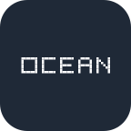
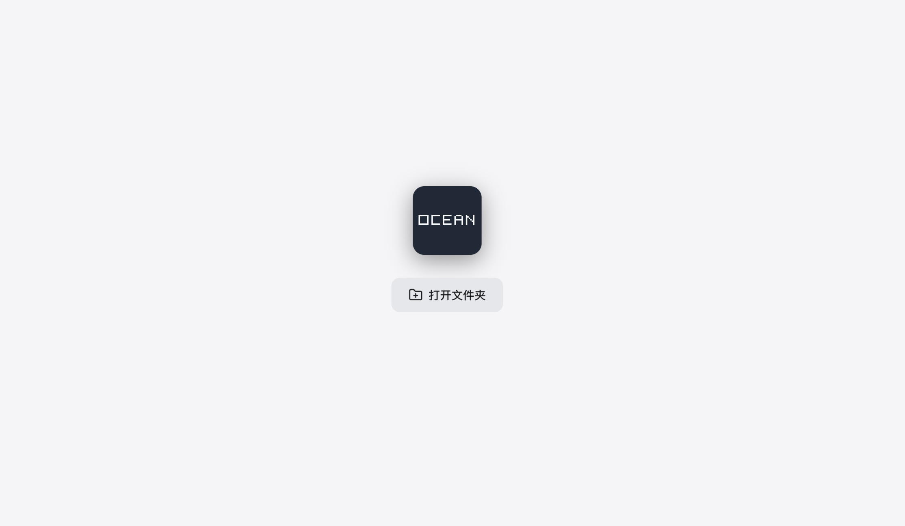

<div align="center">



# Ocean

**Coding-Agent Asset & Capability Visualization Management Platform**

A desktop application built with `Electron` + `React` + `TypeScript` that uses Markdown files as the core data carrier. All data is stored locally, providing unified management and visual orchestration for coding agent assets including agents, skills, knowledge, nodes, resources, workflows, and more.

<p align="center">
  <a href="https://opensource.org/licenses/MIT"></a>
  <a href="https://github.com/zhangz1w3nCode/Ocean/stargazers"></a>
  <a href="https://github.com/zhangz1w3nCode/Ocean"></a>
</p>

[English](./README.md) | [中文](./README_CN.md)

</div>

<p align="center">
  
</p>

---

## Why Ocean

Coding agents are powerful AI tools, but managing their assets (agents, skills, knowledge, nodes, resources, workflows) is scattered across directories and text files. Ocean provides a unified visual management platform purpose-built for coding agents, turning these scattered Markdown files into a coherent, manageable system.

- **Reference, not copy** -- Assets are linked through `@` references and `%` WikiLinks instead of being duplicated. A single source of truth means editing a shared asset or knowledge entry automatically reflects everywhere it is referenced.
- **Knowledge as a graph** -- Knowledge entries are stored as individual Markdown files and connected via WikiLinks with labeled relationships. The entire knowledge network is rendered as an interactive force-directed graph where you can click any node to view details, and tune physics parameters like centripetal force and node distance.
- **Zero data lock-in** -- All data is stored as standard Markdown files in the project's asset directories (`.claude/`, `.pi/`, `.knowledges/`, `.nodes/`, `.resources/`, `.workflows/`). You can edit them with any text editor or use Ocean's visual interface.
- **Fully local** -- No cloud services, no accounts, no data uploads. Your assets stay on your machine.
- **Visual orchestration** -- Compose complex workflows by dragging and connecting nodes on a canvas. Each node is interactive -- click to configure, drag to reposition, branch to create decision paths. The visual approach makes multi-step workflows tangible and intuitive to build.

## Features

### Asset Management

Ocean manages 6 types of coding agent assets, each with full CRUD operations, Markdown preview, and reference linking:

Agents and skills are loaded from a switchable asset source (Settings > Asset Source); knowledge, nodes, resources, and workflows live in project-level shared directories.

| Module | Storage Location | Description |
|--------|-----------------|-------------|
| Agents | `.claude/agents/` or `.pi/agents/` | Define AI agent profiles with model selection, role instructions, and icon customization |
| Skills | `.claude/skills/` or `.pi/skills/` | Package complex skills with scripts, references, and examples in a directory structure |
| Knowledge | `.knowledges/` | Manage business knowledge with tags, categories, WikiLink references, and a visual knowledge graph |
| Nodes | `.nodes/` | Define reusable workflow building blocks |
| Resources | `.resources/` | Manage reference resource files |
| Workflows | `.workflows/` | Design and manage workflow definitions |

### Visual Workflow Editor

Build complex multi-step workflows through direct visual manipulation instead of editing configuration files by hand.

- Drag-and-drop flow editor built on React Flow
- 6 node types: Start, End, Process, Decision, Business, Local
- Click any node to open its property panel for inline editing
- Drag to reposition nodes, draw edges to define execution paths
- Branch management for decision nodes with dynamic output handles
- Auto-layout powered by Dagre algorithm
- Grid snapping, multi-select, copy/paste, context menu
- Generates structured WORKFLOW.md output with Mermaid flowcharts and step-by-step execution paths

### Knowledge Graph

Each knowledge entry is a standalone Markdown file. Entries are connected via WikiLinks (`[[file.md|relation]]`) with labeled relationships, and the entire network is visualized as an interactive force-directed graph.

- Force-directed graph visualization powered by D3-force
- WikiLink syntax with relationship labels (e.g., `[[architecture.md|depends-on]]`)
- Click any node to open its detail view directly from the graph
- Dynamic node sizing based on reference count -- highly referenced entries stand out visually
- Interactive hover highlighting with smooth fade animations
- Configurable physics: centripetal force, node link distance, velocity decay, and more
- Relationship labels rendered on edges with toggle visibility
- Node coloring based on in-degree / out-degree to distinguish knowledge hubs from leaf entries

### AI-Powered Creation

Multiple creation modes powered by LLM integration:

- **Manual creation** -- Write content directly
- **LLM creation** -- Generate content using AI with customizable prompt templates
- **Agentic creation** -- AI autonomously creates content using tools and file system access

Additional AI features:
- Content optimization with git diff-style comparison
- 20+ LLM provider support via pi-mono SDK
- Configurable model parameters (temperature, max_tokens, etc.)

### Cross-Asset Reference System

Ocean uses a reference-based architecture instead of copying content between assets:

- **`@` reference** -- Type `@` in the Markdown editor to insert a reference to any asset (agents, skills, knowledge entries, resources, nodes, workflows). The referenced content is stored as a file path, not a copy. When the source asset is updated, all references stay in sync.
- **`%` WikiLink** -- Type `%` to insert a WikiLink (`[[file.md|relation]]`) that creates bidirectional links between knowledge entries. These relationships are visualized in the knowledge graph.

This means each piece of content exists in exactly one place. Editing the source automatically reflects across all references -- no version drift, no stale copies. Every improvement to a shared asset compounds across the entire system: the more you reference, the greater the return.

### Markdown Editor & Rendering

- CodeMirror 6-based Markdown editor with syntax highlighting
- GitHub Flavored Markdown rendering (tables, strikethrough, task lists)
- Mermaid diagram rendering
- Code block syntax highlighting (highlight.js)
- Rehype-raw for embedded HTML support

## Tech Stack

| Category | Technology | Version |
|----------|-----------|---------|
| Framework | React | 19.2 |
| Language | TypeScript | 5.9 |
| Build Tool | Vite | 5.4 |
| Desktop | Electron | 40.4 |
| Styling | Tailwind CSS | 3.4 |
| Animation | Framer Motion | 12.34 |
| Icons | Lucide React | 0.563 |
| State Management | Zustand | 5.0 |
| Flow Editor | @xyflow/react (React Flow) | 12.10 |
| Auto Layout | @dagrejs/dagre | 2.0 |
| Force Graph | D3-force + react-force-graph-2d | 3.0 / 1.29 |
| Code Editor | CodeMirror 6 (@uiw/react-codemirror) | 4.25 |
| Markdown Rendering | react-markdown + remark-gfm + rehype-highlight | 10.1 |
| Diagrams | Mermaid | 11.12 |
| Drag & Drop | @dnd-kit | 6.3 / 10.0 |
| Frontmatter | yaml | 2.9 |
| Testing | Vitest | 2.1 |
| AI/LLM | pi-mono SDK (@mariozechner/pi-agent-core, pi-ai, pi-coding-agent) | 0.57 |
| Package Manager | pnpm | 10.19 |

## Getting Started

### Prerequisites

- **Node.js** >= 18
- **pnpm** >= 8 (recommended: 10.19+)

### Installation

```bash
# Clone the repository
git clone https://github.com/zhangz1w3nCode/ocean.git
cd ocean

# Install dependencies
pnpm install
```

### Development

```bash
# Start the Vite dev server (web mode)
pnpm dev

# Start Electron dev mode (desktop app)
pnpm electron:dev
```

The web dev server starts at `http://localhost:5173`. Electron dev mode launches the desktop app with hot-reload.

### Build

```bash
# Build web assets
pnpm build

# Build and package Electron app
pnpm electron:build
```

Build outputs:
- **Web**: `dist/`
- **macOS**: `release/` (DMG for Apple Silicon arm64)
- **Windows**: `release/` (NSIS installer for x64)

## Project Structure

```
ocean/
├── electron/                    # Electron main process
│   ├── launch.cjs               # Main process entry (IPC handlers, file system ops)
│   └── preload.dev.cjs          # Preload script (exposes electronAPI)
├── src/
│   ├── main.tsx                 # Application entry point
│   ├── App.tsx                  # Root component (project loading, layout)
│   ├── pages/                   # Page components
│   │   ├── ProjectSelectionPage.tsx
│   │   ├── AgentsPage.tsx
│   │   ├── SkillsPage.tsx
│   │   ├── KnowledgesPage.tsx
│   │   ├── NodesPage.tsx
│   │   ├── ResourcesPage.tsx
│   │   ├── WorkflowsPage.tsx
│   │   ├── FlowEditorPage.tsx
│   │   ├── SettingsPage.tsx
│   │   └── LLMSettings.tsx
│   ├── components/              # UI components
│   │   ├── agent/               # Agent module components
│   │   ├── flow/                # Flow editor components & node types
│   │   ├── knowledge/           # Knowledge module & graph components
│   │   ├── layout/              # Layout components (Sidebar, MainContent)
│   │   ├── node/                # Node module components
│   │   ├── resource/            # Resource module components
│   │   ├── settings/            # Settings components (LLM, CLI Agent, Asset Source, Agentic)
│   │   ├── skill/               # Skill module components
│   │   ├── ui/                  # Shared UI components (Modal, MarkdownEditor, MarkdownRenderer)
│   │   └── workflow/            # Workflow module components
│   ├── hooks/                   # Custom React hooks
│   │   ├── useAgentLoop.ts      # Agent loop execution hook
│   │   ├── useAgenticExecutor.tsx # Agentic mode executor hook
│   │   ├── useKnowledgeGraph.ts # Knowledge graph hook
│   │   └── useReferenceItems.ts # Cross-asset reference hook
│   ├── services/                # Business logic services
│   │   ├── llmService.ts        # LLM API integration
│   │   ├── agentLoopService.ts  # Agent loop execution service
│   │   └── agenticService.ts    # Agentic creation service
│   ├── stores/                  # Zustand state stores (11 stores)
│   ├── types/                   # TypeScript type definitions
│   └── utils/                   # Utility functions
│       ├── storage.ts           # Storage helpers
│       ├── asset-config.ts      # Asset source helpers
│       ├── workflow-generator.ts # Workflow document generator
│       └── knowledgeGraphParser.ts # Knowledge graph data parser
├── assets/                      # README images (logo, screenshots)
├── build/                       # Build assets (app icons)
├── package.json
├── vite.config.ts
├── tsconfig.json
├── tailwind.config.ts
└── LICENSE                      # MIT License
```

## Data Storage

All data is stored as plain Markdown files (with optional YAML Frontmatter) inside the project directory:

```
your-project/
├── .claude/  (or .pi/)          # Asset-source root (switchable in Settings)
│   ├── agents/                  # Agent definitions (*.md)
│   └── skills/                  # Skill packages (directory per skill)
│       └── skill-name/
│           ├── SKILL.md
│           ├── scripts/
│           ├── references/
│           └── examples/
├── .knowledges/                 # Knowledge entries (*.md) -- shared across asset sources
├── .nodes/                      # Node definitions (*.md) -- shared
├── .resources/                  # Resource files (*.md) -- shared
└── .workflows/                  # Workflow definitions -- shared
    └── workflow-name/
        ├── WORKFLOW.md          # Generated workflow document
        └── flow.json            # Graph structure (nodes & edges)
```

Agents and skills are loaded from `.claude/` or `.pi/` depending on the active asset source, which you can switch in Settings. Knowledge, nodes, resources, and workflows are stored in project-level shared directories and shared across both ecosystems.

Each asset is a standard Markdown file with optional YAML Frontmatter metadata. This means you can version-control your assets with Git and edit them with any text editor.

## License

[MIT](./LICENSE)
