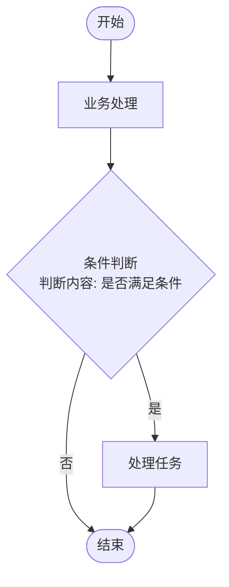

<div align="center">

# Ocean

**CLI Agent 资产和能力可视化管理平台**

一款基于 Electron + React + TypeScript 构建的桌面应用，以 Markdown 文件为核心数据载体，为 CLI Agent（如 Claude Code）提供智能体、命令、能力、知识库、工作流等资产的统一管理与可视化编排能力。

[English](./README.md) | [中文](./README_CN.md)

</div>

---

## 核心特性

- **本地优先** - 所有数据以 Markdown 文件形式存储在本地 `.claude/` 目录，完全掌控数据
- **可视化编辑** - 使用 `@xyflow/react` 提供专业的流程图编辑能力，支持拖拽、连线、撤销重做
- **知识图谱** - 基于 WikiLink 引用关系构建知识图谱，支持力导向布局可视化
- **多维引用** - 支持 `@引用` 和 `[[WikiLink]]` 两种引用语法，建立业务实体间的关联
- **Markdown 优先** - 所有业务数据以 `.md` 文件存储，易于版本控制和人机协作
- **双环境支持** - Electron 桌面应用 + 浏览器预览，灵活适配不同场景
- **Mermaid 图表** - 支持在 Markdown 中渲染 Mermaid 流程图、时序图、类图等多种图表
- **Agentic 创建** - 支持通过 AI Agent 自动生成能力文档，简化内容创建流程
- **LLM 参数配置** - 供应商配置支持自定义模型参数（温度、最大 token 等）
- **实时文件加载** - 工作流详情等内容实时从本地文件加载，修改即时生效

---

## 业务模块

Ocean 包含八大核心业务模块和一个设置模块，每个模块的数据以 Markdown 文件形式独立存储：

| 模块 | 存储目录 | 文件类型 | 描述 |
|------|----------|----------|------|
| **智能体** | `.claude/agents/` | `sub-agent`, `mcp` | AI 智能体配置与角色定义 |
| **命令** | `.claude/commands/` | `command` | 可执行命令与斜杠指令 |
| **能力** | `.claude/abilities/` | `ability` | AI 能力单元定义，支持 LLM 创建与优化 |
| **技能** | `.claude/skills/` | `skill` | 可复用的技能定义与组合，含脚本/参考/示例资源 |
| **知识** | `.claude/knowledges/` | `knowledge` | 业务知识库管理，支持 Agentic 自动创建 |
| **工作流** | `.claude/workflows/` | `workflow` | 可视化流程定义与编排，含本地节点文件夹 |
| **节点** | `.claude/nodes/` | `business`, `process` | 工作流节点模板定义 |
| **资源文件** | `.claude/resources/` | `rule`, `reference`, `tool` | 规则说明、参考文档、工具说明 |
| **设置** | 配置文件 | JSON | LLM 供应商、CLI Agent、Agentic 模式、能力/技能/知识配置 |

### 工作流节点类型

流程编辑器支持六种节点类型：

| 节点类型 | 图标颜色 | 功能描述 |
|----------|----------|----------|
| 开始节点 | 绿色 | 工作流入口点 |
| 处理节点 | 蓝色 | 通用处理步骤，支持在线编辑任务 |
| 判断节点 | 黄色 | 条件分支，支持自定义分支配置 |
| 业务节点 | 紫色 | 引用全局节点模板，承载复杂业务逻辑 |
| 本地节点 | 蓝色 | 工作流私有节点，内容存储在工作流目录下 |
| 结束节点 | 红色 | 工作流出口点 |

### 设置模块

设置模块提供全局配置管理，包含五个设置分类：

| 分类 | 功能描述 |
|------|----------|
| **LLM 供应商** | 管理多个 LLM API 供应商（OpenAI/Anthropic/Azure/自定义），支持连接测试和模型参数配置 |
| **Agentic 模式** | 配置 AI Agent 自主执行模式，支持文件读写/编辑/搜索/终端等7种工具，可设置迭代次数和超时 |
| **能力配置** | 配置能力 LLM 创建和优化的提示词模板 |
| **技能配置** | 配置技能相关的全局设置 |
| **知识配置** | 配置知识库 Agentic 创建的全局设置 |

---

## 技术栈

| 层级 | 技术选型 |
|------|----------|
| 前端框架 | React 19 |
| 构建工具 | Vite 5 |
| 语言 | TypeScript 5 |
| 状态管理 | Zustand 5 |
| 流程图引擎 | @xyflow/react 12 |
| 桌面框架 | Electron 40 |
| 样式 | Tailwind CSS 3 |
| 动画 | framer-motion 12 |
| 图标 | lucide-react |
| Markdown 渲染 | react-markdown + remark-gfm |
| 代码编辑器 | @uiw/react-codemirror |
| 知识图谱 | react-force-graph-2d + d3-force |
| 图表渲染 | mermaid |

---

## 快速开始

### 环境要求

- Node.js >= 18.0.0
- pnpm >= 8.0.0

### 安装依赖

```bash
pnpm install
```

### 开发模式

#### 方式一：Electron 桌面端调试（推荐）

同时启动 Vite 开发服务器和 Electron 应用，支持热更新：

```bash
pnpm electron:dev
```

该命令会：
1. 启动 Vite 开发服务器（默认端口 5173）
2. 等待 Vite 服务就绪后自动启动 Electron
3. 自动打开 DevTools 调试工具

#### 方式二：仅启动 Web 开发服务器

```bash
pnpm dev
```

然后在浏览器中访问 `http://localhost:5173`

#### 方式三：预览已构建的 Electron 应用

```bash
pnpm build
pnpm electron:preview
```

### 构建打包

```bash
# 构建前端资源
pnpm build

# 构建 Electron 主进程
pnpm build:electron

# 打包桌面应用（输出到 release/ 目录）
pnpm electron:build
```

---

## 项目结构

```
ocean/
├── electron/                   # Electron 主进程
│   ├── launch.cjs             # 开发环境启动脚本（CJS）
│   └── preload.dev.cjs        # 开发环境 Preload 脚本
├── src/
│   ├── components/
│   │   ├── ability/           # 能力模块组件
│   │   ├── agent/             # 智能体模块组件
│   │   ├── command/           # 命令模块组件
│   │   ├── flow/              # 流程编辑器组件
│   │   │   ├── FlowCanvas.tsx
│   │   │   ├── FlowToolbar.tsx
│   │   │   ├── NodePanel.tsx
│   │   │   ├── PropertiesPanel.tsx
│   │   │   └── nodes/         # 节点组件
│   │   ├── knowledge/         # 知识模块组件
│   │   ├── layout/            # 布局组件
│   │   ├── node/              # 节点管理组件
│   │   ├── resource/          # 资源文件组件
│   │   ├── settings/          # 设置（LLM、Agentic、CLI Agent 等）
│   │   ├── skill/             # 技能模块组件
│   │   ├── ui/                # 通用 UI 组件
│   │   │   ├── MarkdownEditor/
│   │   │   └── MarkdownRenderer/
│   │   └── workflow/          # 工作流组件
│   ├── pages/                 # 页面组件
│   ├── stores/                # Zustand 状态管理
│   ├── types/                 # TypeScript 类型定义
│   ├── utils/                 # 工具函数
│   └── hooks/                 # React Hooks
├── dist/                      # Web 构建输出
├── dist-electron/             # Electron 构建输出
└── release/                   # 打包后的应用程序
```

---

## 数据存储

### 存储目录

所有业务数据以 Markdown 文件形式存储在项目根目录的 `.claude/` 隐藏目录中：

```
项目根目录/
└── .claude/
    ├── agents/        # 智能体文件 (*.md)
    ├── commands/      # 命令文件 (*.md)
    ├── abilities/     # 能力文件 (*.md)
    ├── knowledges/    # 知识库文件 (*.md)
    ├── workflows/     # 工作流文件 (*.md)
    │   └── {workflow}/
    │       └── nodes/ # 工作流本地节点 (*.md)
    ├── nodes/         # 全局节点定义文件 (*.md)
    ├── resources/     # 资源文件 (*.md)
    └── skills/        # 技能文件 (*.md)
        └── {skill}/
            ├── SKILL.md      # 技能主文件
            ├── scripts/      # 脚本文件
            ├── references/   # 参考文件
            └── examples/     # 示例文件
```

### Markdown 格式规范

所有业务实体使用 YAML Frontmatter 存储元数据：

```markdown
---
name: 示例智能体
description: 这是一个AI智能体
model: haiku
color: blue
---

# 智能体内容

这里是智能体的详细说明...
```

### 工作流 Markdown 输出示例

```markdown
---
type: workflow
name: 示例工作流
description: 这是一个示例工作流
---

# 示例工作流

## 描述
- 这是一个示例工作流

## 输入物料
- 输入1
- 输入2

## 输出产物
- 输出1

## 流程



## 节点

| 节点名称 | 执行内容 |
|----------|----------|
| 业务处理 | `.claude/nodes/业务处理.md` |
| 处理任务 | `任务描述内容` |

## 强制事项
- 强制创建一个`TodoList`列表来跟踪整个`流程`
- 强制严格按照`流程`执行 禁止跳过任何`流程`中的阶段
- `执行内容`中如果有文件路径代表这是该节点需要执行的任务 必须强制读取和完成
- 强制遵循`渐进式加载节点文件详情原则` 先查看并且理解`流程`整体内容 等你执行到某个节点之后才去查看`节点`中对应的具体内容`执行内容`
- 强制节点重试：如果执行某个节点没有达到预期那么尝试重试2次再进行下一个节点

## 禁止事项
- 禁止直接读取`执行内容`的文件
- 禁止编造/假设/伪造/杜撰/猜测/说谎一切信息

## 最佳实践
### 执行流程
- 1.查看WORKFLOW.md文件
- 2.理解`流程`整体内容 不查看节点具体文件
- 3.创建`TodoList`
- 4.按照`流程`中的节点执行
- 5.查看到`xxx`节点名称
- 6.通过`节点`中的节点名称映射到具体执行内容文件或者任务描述
- 7.读取并且节点的执行内容
- 8.如果执行成功更新`TodoList`任务状态 执行下一个节点 如果执行不成功执行重试
- 9.执行下一个节点 循环`读取节点`->`查看节点任务详情`->`执行节点`-`更新任务状态`执行到结束节点结束流程
```

---

## 核心功能

### 引用功能

支持两种引用语法：

#### @ 引用

在编辑器中输入 `@` 符号触发引用选择弹窗，支持引用各业务模块的实体：

```
@智能体名 -> `.claude/agents/智能体名.md`
@节点名 -> `.claude/nodes/节点名.md`
```

#### WikiLink

支持 Obsidian 风格的 WikiLink 语法：

```
[[xxx.md|关系]]     # 带关系名称的链接
[[xxx.md]]          # 普通链接，默认关系为"关联"
```

不同业务类型自动识别颜色：
- `/agents/` - 紫色（智能体）
- `/nodes/` - 蓝色（节点）
- `/workflows/` - 红色（工作流）
- `/commands/` - 紫色（命令）
- `/resources/` - 绿色（资源）
- `/abilities/` - 黄色（能力）
- `/knowledges/` - 蓝色（知识）
- `/skills/` - 橙色（技能）

### 知识图谱

基于 WikiLink 引用关系构建知识图谱：

- **力导向布局** - 节点互斥力、向心力、连线吸引力可调节
- **双向引用合并** - 自动合并双向引用关系，避免标签重叠
- **交互功能** - 悬浮高亮、拖拽节点、点击跳转详情
- **可配置参数** - 节点大小、连线长度、标签大小等

### 流程编辑器快捷键

| 快捷键 | 功能 |
|--------|------|
| Ctrl+Z | 撤销 |
| Ctrl+Y / Ctrl+Shift+Z | 重做 |
| Ctrl+C | 复制选中节点 |
| Ctrl+V | 粘贴节点 |
| Delete / Backspace | 删除选中项 |
| Ctrl+点击 | 多选节点 |
| Shift+拖拽 | 框选节点 |
| 双指滑动 | 平移画布（Mac 触摸板）|

---

## 架构

```
+-----------------------------------------------------------+
|                    前端层 (React)                           |
|  +-----------+ +------------+ +---------+ +-------------+ |
|  |   页面    | |   组件库   | | 状态管理 | |  流程编辑器  | |
|  +-----------+ +------------+ +---------+ +-------------+ |
+-----------------------------------------------------------+
|                    存储层 (Storage)                         |
|         localStorage (浏览器) / Node FS (Electron)         |
+-----------------------------------------------------------+
|                    IPC 通信层                               |
|         window.electronAPI / Preload Script               |
+-----------------------------------------------------------+
|                    Electron 主进程                          |
|         文件系统操作 + 对话框 + 配置管理                     |
+-----------------------------------------------------------+
```

---

## 常见问题

### Electron 安装失败

如果 Electron 安装失败，可以使用国内镜像：

```bash
export ELECTRON_MIRROR="https://npmmirror.com/mirrors/electron/"
pnpm install
```

### 端口被占用

如果默认端口 5173 被占用，Vite 会自动尝试下一个可用端口。

### DevTools 调试

在 Electron 应用中：
- 快捷键：`Cmd + Option + I`（macOS）
- 菜单：View -> Toggle Developer Tools

### Mermaid 图表渲染问题

如果 Mermaid 图表无法正常渲染，请确保：
- 已执行 `pnpm install` 安装所有依赖
- Vite 配置中已包含 `optimizeDeps: { include: ['mermaid'] }`
- 图表语法正确，可参考 [Mermaid 官方文档](https://mermaid.js.org/)

---

## 参与贡献

欢迎贡献代码! 请随时提交 Pull Request。

1. Fork 本仓库
2. 创建特性分支 (`git checkout -b feature/amazing-feature`)
3. 提交更改 (`git commit -m 'Add some amazing feature'`)
4. 推送到分支 (`git push origin feature/amazing-feature`)
5. 发起 Pull Request

## 许可证

[MIT](./LICENSE)
