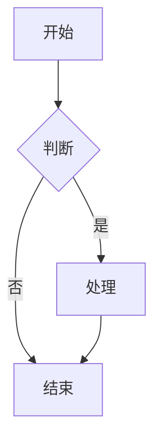
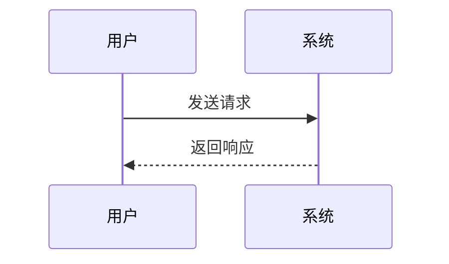
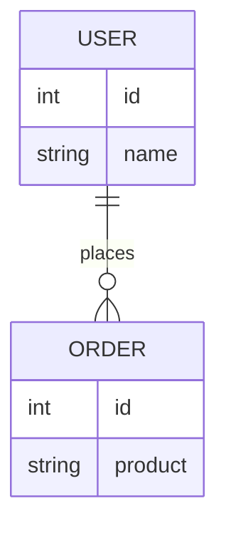

# Mermaid 图表渲染设计文档

## 概述

本文档描述了Markdown内容中Mermaid图表的渲染功能设计。该功能允许用户在智能体、知识、命令、资源、能力等模块中使用Mermaid语法编写图表，在预览模式和详情弹窗中自动渲染为可视化图像。

## 功能需求

### 背景
用户反馈在Markdown预览页面中，mermaid图表语法块不能被渲染成图像，只能看到原始代码，不够直观。

### 目标
- 支持Mermaid图表语法渲染
- 渲染失败时静默处理，不影响用户体验
- 统一管理Markdown渲染逻辑

### 支持的图表类型
- **flowchart/graph**: 流程图
- **sequenceDiagram**: 时序图
- **classDiagram**: 类图
- **stateDiagram**: 状态图
- **erDiagram**: ER图
- **gantt**: 甘特图
- **pie**: 饼图
- **gitGraph**: Git图
- **mindmap**: 思维导图
- **timeline**: 时间线
- **quadrantChart**: 象限图

## 技术架构

### 依赖
- `mermaid`: ^11.12.3 - Mermaid核心渲染库
- `react-markdown`: 现有依赖 - Markdown解析
- `remark-gfm`: 现有依赖 - GitHub风格Markdown
- `rehype-highlight`: 现有依赖 - 代码高亮

### 组件结构

```
flow-editor/src/components/ui/MarkdownRenderer/
├── MarkdownRenderer.tsx    # 统一的Markdown渲染组件
├── MermaidBlock.tsx        # Mermaid图表渲染组件
└── index.ts               # 组件导出
```

## 组件设计

### 1. MarkdownRenderer 组件

**文件**: `MarkdownRenderer.tsx`

统一封装ReactMarkdown配置，处理代码块类型判断和内容提取。

```tsx
interface MarkdownRendererProps {
  content: string
  className?: string
}
```

**核心逻辑**:
- 检测代码块语言标识
- 正确提取代码内容（处理children为数组的情况）
- Mermaid代码块使用MermaidBlock渲染
- 其他代码块使用highlight.js语法高亮

### 2. MermaidBlock 组件

**文件**: `MermaidBlock.tsx`

负责Mermaid图表的异步渲染和错误处理。

```tsx
interface MermaidBlockProps {
  code: string
}
```

**核心特性**:
- 单例初始化mermaid配置（避免重复初始化）
- 图表有效性预检查（检查关键字）
- 异步渲染SVG
- 静默失败机制（渲染出错不显示错误）
- 唯一ID生成（使用时间戳保证唯一性）

**mermaid配置**:
```ts
mermaid.initialize({
  startOnLoad: false,
  theme: 'default',
  securityLevel: 'loose',
  fontFamily: 'Inter, -apple-system, BlinkMacSystemFont, sans-serif',
  flowchart: {
    useMaxWidth: true,
    htmlLabels: true,
    curve: 'basis',
  },
  sequence: {
    useMaxWidth: true,
    diagramMarginX: 50,
    diagramMarginY: 10,
    actorMargin: 50,
    width: 150,
    height: 65,
  },
})
```

## 样式设计

**文件**: `tailwind.css`

```css
/* Mermaid 图表样式 */
.mermaid-container {
  overflow-x: auto !important;
  margin: 1em 0 !important;
}

.mermaid-container.mermaid-svg {
  display: flex;
  justify-content: center;
  align-items: center;
}

.mermaid-container.mermaid-svg svg {
  max-width: 100%;
  height: auto;
}
```

**设计说明**:
- 移除了外层边框和背景，图表直接渲染
- 支持横向滚动适应大图
- 居中显示
- 响应式最大宽度

## 使用组件清单

以下组件已替换为使用MarkdownRenderer：

| 组件 | 文件路径 | 使用场景 |
|------|---------|----------|
| AgentDetailModal | `components/agent/AgentDetailModal.tsx` | 智能体详情弹窗 |
| AgentModal | `components/agent/AgentModal.tsx` | 智能体编辑弹窗预览 |
| KnowledgeDetailModal | `components/knowledge/KnowledgeDetailModal.tsx` | 知识详情弹窗 |
| KnowledgeModal | `components/knowledge/KnowledgeModal.tsx` | 知识编辑弹窗预览 |
| CommandDetailModal | `components/command/CommandDetailModal.tsx` | 命令详情弹窗 |
| CommandModal | `components/command/CommandModal.tsx` | 命令编辑弹窗预览 |
| ResourceDetailModal | `components/resource/ResourceDetailModal.tsx` | 资源详情弹窗 |
| ResourceModal | `components/resource/ResourceModal.tsx` | 资源编辑弹窗预览 |
| AbilityDetailModal | `components/ability/AbilityDetailModal.tsx` | 能力详情弹窗 |
| AbilityModal | `components/ability/AbilityModal.tsx` | 能力编辑弹窗预览 |

## 错误处理策略

### 静默失败
- 渲染失败时不显示任何错误信息
- 控制台输出警告日志供调试
- 返回null不渲染任何内容

### 有效性检查
渲染前检查代码是否包含有效的Mermaid图表类型关键字，提前过滤无效代码：

```ts
const validKeywords = [
  'graph ', 'flowchart ', 'sequenceDiagram', 'classDiagram',
  'stateDiagram', 'erDiagram', 'gantt', 'pie', 'gitGraph',
  'mindmap', 'timeline', 'quadrantChart', 'requirementDiagram',
  'json', 'yaml', 'block-beta', 'packet-beta', 'architecture-beta'
]
```

### 停止条件
- 代码为空或仅包含空白字符
- 不包含有效的Mermaid图表类型关键字
- 渲染过程中抛出异常

## 使用示例

### 流程图
```markdown

```

### 时序图
```markdown

```

### ER图
```markdown

```

## 注意事项

1. **Mermaid语法规范**: 用户需要使用正确的Mermaid语法，空代码块无法渲染
2. **中文字符**: Mermaid支持中文字符，但某些特殊字符可能导致渲染问题
3. **图表大小**: 大型图表可能需要横向滚动查看
4. **性能**: 复杂图表渲染可能需要一定时间，已移除加载提示避免闪烁

## 版本记录

| 日期 | 版本 | 描述 |
|------|------|------|
| 2026-03-13 | v1.1 | 修复 Vite 开发环境动态导入问题 - 添加 optimizeDeps 配置和核心模块预加载 |
| 2026-03-02 | v1.0 | 初始版本，支持Mermaid图表渲染 |

---

## 常见问题修复

### Vite 开发环境动态导入错误

**问题现象**：
```
Mermaid render warning: TypeError: Failed to fetch dynamically imported module:
http://localhost:5173/node_modules/.vite/deps/flowDiagram-xxx.js
```

**问题原因**：
- Mermaid v11 采用按需加载架构，渲染流程图时会动态导入 `flowDiagram-xxx.js`
- Vite 的依赖预构建默认不会处理这些深层动态导入
- 浏览器无法找到这些动态加载的 chunk 文件

**解决方案**：

1. **vite.config.ts** - 添加依赖预构建配置：
```typescript
optimizeDeps: {
  include: ['mermaid'],
}
```

2. **MermaidBlock.tsx** - 预加载核心模块并禁用外部动态导入：
```typescript
import 'mermaid/dist/mermaid.core.mjs'

mermaid.initialize({
  loadExternalDiagramsAtStartup: false,
  // ... 其他配置
})
```

**操作步骤**：
```bash
# 1. 清除 Vite 缓存
rm -rf node_modules/.vite

# 2. 重启开发服务器
pnpm dev
```