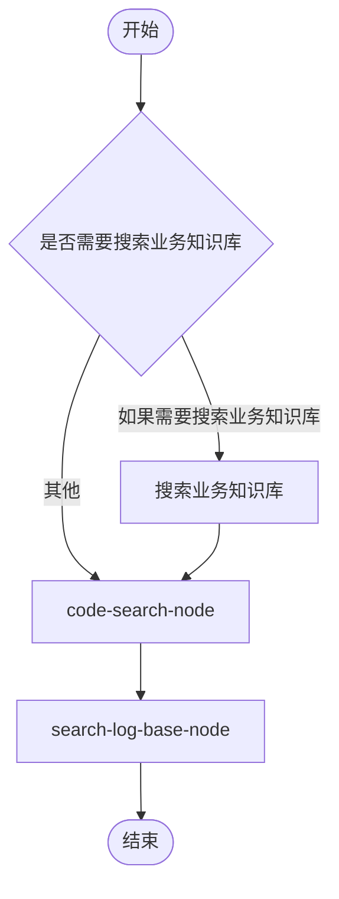

# 工作流编辑器前端设计规范

> 本文档总结了工作流编辑器模块的前端UI设计、交互效果和视觉规范，供开发和维护参考。

---

## 一、设计理念

### 1.1 整体风格

- **工业级布局**：主画布占据绝大部分空间，侧边栏可折叠
- **浮动面板**：属性面板浮动显示，不占用固定空间
- **简约现代**：采用极简设计风格，减少视觉干扰
- **灰色基调**：以灰色、白色为主色调，营造专业、稳重的视觉感受

### 1.2 核心原则

- 画布优先，最大化编辑区域
- 节点样式统一，视觉一致性强
- 交互反馈及时，操作流畅自然
- 状态变化平滑，无突兀跳变

---

## 二、弹窗布局设计

### 2.1 整体结构

```
┌─────────────────────────────────────────────────────────────┐
│ 工具栏(返回 | 名称 | 撤销/重做 | 保存/应用 | 关闭)│
├────────┬────────────────────────────────────────────────────┤
│││
│节点库│主画布区域│
│ [折叠]││
││[浮动属性面板]│
│通用节点││
│业务节点││
│││
└────────┴────────────────────────────────────────────────────┘
```

### 2.2 弹窗尺寸

```css
/* 弹窗容器 */
.workflow-modal {
  width: 1200px;
  height: 700px;
  max-width: 95vw;
  max-height: 90vh;
  background-color: white;
  border-radius: 1rem;              /* rounded-2xl */
  box-shadow: 0 25px 50px -12px rgba(0, 0, 0, 0.25);
}
```

### 2.3 遮罩层

```css
/* 遮罩层 */
.modal-overlay {
  position: fixed;
  inset: 0;
  background-color: rgba(0, 0, 0, 0.3);
  backdrop-filter: blur(4px);
  z-index: 50;
}
```

### 2.4 文件位置

```
src/components/workflow/WorkflowEditorModal.tsx
```

---

## 三、节点面板设计

### 3.1 面板结构

```
┌──────────────────┐
│ 节点库[折叠] │
├──────────────────┤
│ [搜索框]│
├──────────────────┤
│ ▼ 通用节点│
│   开始│
│   结束│
│   处理节点│
│   判断节点│
├──────────────────┤
│ ▼ 业务节点│
│   用户自定义...│
├──────────────────┤
│拖拽节点到画布│
└──────────────────┘
```

### 3.2 面板尺寸

```css
/* 展开状态 */
.node-panel {
  width: 208px;                    /* w-52 */
  height: 100%;
  background-color: white;
  border-right: 1px solid #E5E7EB;/* border-gray-200 */
}

/* 折叠状态 */
.node-panel-collapsed {
  width: 48px;                     /* w-12 */
}
```

### 3.3 节点分类

| 分类 | 包含节点 | 说明 |
|------|----------|------|
| 通用节点 | 开始、结束、处理节点、判断节点 | 系统默认提供 |
| 业务节点 | 用户自定义节点 | 从节点模块同步 |

### 3.4 系统默认节点

```typescript
const defaultNodes: NodeTemplate[] = [
  { type: 'start', label: '开始', color: '#34C759', icon: Play },
  { type: 'end', label: '结束', color: '#FF3B30', icon: Square },
  { type: 'process', label: '处理节点', color: '#007AFF', icon: Hexagon },
  { type: 'decision', label: '判断节点', color: '#FF9500', icon: GitBranch },
]
```

### 3.5 文件位置

```
src/components/flow/NodePanel.tsx
```

---

## 四、节点样式设计

### 4.1 统一样式规范

所有节点采用统一的矩形卡片样式：

```css
/* 节点基础样式 */
.node-base {
  min-width: 100px;                /* min-w-[100px] */
  padding: 0.625rem 1rem;          /* px-4 py-2.5 */
  border-radius: 0.75rem;          /* rounded-xl */
  background-color: white;
  border: 2px solid #E5E7EB;      /* border-gray-200 */
  box-shadow: 0 10px 15px -3px rgba(0,0,0,0.1);
  transition: all 0.2s;
}

/* 选中状态 */
.node-selected {
  border-color: var(--node-color);
  box-shadow: 0 0 0 4px var(--node-color-light);
}
```

### 4.2 节点类型颜色

| 节点类型 | 主色 | 图标 | 边框/光环色 |
|----------|------|------|-------------|
| 开始 | #34C759 | Play | border-green-400 / ring-green-100 |
| 结束 | #FF3B30 | Square | border-red-400 / ring-red-100 |
| 处理节点 | #007AFF | Hexagon | border-blue-400 / ring-blue-100 |
| 判断节点 | #FF9500 | GitBranch | border-orange-400 / ring-orange-100 |
| 业务节点 | #5856D6 | Hexagon | border-purple-400 / ring-purple-100 |

### 4.3 节点内部结构

```tsx
// 节点组件结构
<div className="node-base">
  {/* 图标 + 标签 */}
  <div className="flex items-center gap-2">
    <div className="w-6 h-6 rounded-full flex items-center justify-center"
         style={{ backgroundColor: `${color}15` }}>
      <Icon size={12} style={{ color }} />
    </div>
    <span className="text-sm font-medium text-gray-800">{label}</span>
  </div>

  {/* 描述（可选） */}
  {description && (
    <p className="mt-1 text-xs text-gray-500">{description}</p>
  )}

  {/* 连接点 */}
  <Handle type="target" position={Position.Left} />
  <Handle type="source" position={Position.Right} />
</div>
```

### 4.4 判断节点特殊处理

判断节点有多个出口 Handle：

```tsx
// 判断节点连接点
<Handle type="target" position={Position.Left} />
<Handle type="source" position={Position.Right} id="yes" />
<Handle type="source" position={Position.Bottom} id="no" />
<Handle type="source" position={Position.Top} id="alternative" />
```

### 4.5 文件位置

```
src/components/flow/nodes/
├── StartNode.tsx
├── EndNode.tsx
├── ProcessNode.tsx
├── DecisionNode.tsx
└── BusinessNode.tsx
```

---

## 五、连线设计

### 5.1 连线样式

```typescript
// 默认边配置
const defaultEdgeOptions = {
  type: 'default',                 // 平滑贝塞尔曲线
  animated: false,
  markerEnd: {
    type: MarkerType.ArrowClosed,  // 箭头
    width: 15,
    height: 15,
    color: '#9CA3AF',              // 灰色箭头
  },
  style: {
    strokeWidth: 2,
    stroke: '#9CA3AF',             // 灰色线条
  },
}
```

#### 支持的连线类型

| 类型 | 效果 | 描述 |
|------|------|------|
| `default` | 平滑贝塞尔曲线 | 弧形曲线，视觉效果最佳（当前使用） |
| `bezier` | 贝塞尔曲线 | 与 default 类似 |
| `smoothstep` | 带圆角的折线 | 直角转折但有圆角 |
| `step` | 直角折线 | 90度直角转折 |
| `straight` | 直线 | 两点之间直线连接 |

### 5.2 连线行为

- 从源节点右边 Handle 拖出
- 连接到目标节点左边 Handle
- 自动显示箭头指向
- 支持删除和编辑

---

## 六、属性面板设计

### 6.1 浮动面板结构

```
┌─────────────────────────┐
│ ● 节点名称× │
├─────────────────────────┤
│ 名称│
│ [输入框]│
│ │
│ 描述│
│ [文本域]│
│ │
│ ─────────────────────│
│ 核心任务│
│ 节点定义内容...│
│ │
│ 输入信息│
│ 节点定义内容...│
│ │
│ 强制同时必须要做的事│
│ 节点定义内容...│
│ │
│ 禁止同时严禁不能做的事│
│ 节点定义内容...│
├─────────────────────────┤
│类型: 处理节点 │
└─────────────────────────┘
```

### 6.2 浮动定位

```css
/* 浮动属性面板 */
.properties-panel {
  position: absolute;
  right: 1rem;                     /* right-4 */
  top: 1rem;                       /* top-4 */
  bottom: 1rem;                    /* bottom-4 */
  width: 288px;                    /* w-72 */
  z-index: 10;
}
```

### 6.3 显示逻辑

- 未选中节点时：不显示
- 选中节点时：浮动显示在画布右侧
- 带进入/退出动画

### 6.4 信息展示

| 信息类型 | 背景 | 说明 |
|----------|------|------|
| 名称/描述 | 无背景 | 可编辑 |
| 核心任务 | gray-50 | 从节点定义获取 |
| 输入信息 | blue-50 | 从节点定义获取 |
| 输出信息 | green-50 | 从节点定义获取 |
| 强制同时必须要做的事 | orange-50 | 警示信息 |
| 禁止同时严禁不能做的事 | red-50 | 危险信息 |

### 6.5 文件位置

```
src/components/flow/PropertiesPanel.tsx
```

---

## 七、多选与剪贴板设计

### 7.1 多选操作方式

| 操作方式 | 说明 |
|---------|------|
| **Shift + 拖拽** | 框选多个节点 |
| **Ctrl/Cmd + 点击** | 逐个添加/移除选中项 |
| **点击空白处** | 清除所有选择 |

### 7.2 多选状态管理

```typescript
// flowEditorStore 多选状态
interface FlowEditorState {
  selectedNodeId: string | null      // 主选节点（最后点击的）
  selectedEdgeId: string | null      // 主选边
  selectedNodeIds: string[]          // 多选节点数组
  selectedEdgeIds: string[]          // 多选边数组
}
```

### 7.3 剪贴板操作

| 快捷键 | 功能 |
|--------|------|
| Ctrl+C | 复制选中的节点及其之间的连线 |
| Ctrl+V | 粘贴节点（偏移20px，生成新ID） |
| Delete | 删除所有选中节点及关联连线 |

### 7.4 剪贴板数据结构

```typescript
interface ClipboardData {
  nodes: ReactFlowNode[]    // 复制的节点
  edges: ReactFlowEdge[]    // 节点间的连线
}
```

---

## 八、节点数据关联设计

### 8.1 节点数据扩展

```typescript
export interface ReactFlowNode extends Node {
  type: 'start' | 'process' | 'decision' | 'end' | 'business'
  data: {
    label: string
    description?: string
    // 节点定义关联
    nodeDefId?: string           // 关联的节点定义ID
    nodeDefName?: string         // 节点定义名称
    // 从节点定义复制的信息
    task?: string                // 核心任务
    inputs?: string              // 输入信息
    outputs?: string             // 输出信息
    requiredActions?: string     // 强制同时必须要做的事
    forbiddenActions?: string    // 禁止同时严禁不能做的事
    additionalNotes?: string     // 额外说明
    customFields?: CustomField[] // 自定义字段
    config?: Record<string, any> // 画布实例配置
  }
}
```

### 8.2 拖拽关联流程

```
用户拖拽节点 → NodePanel传递nodeDefId
                ↓
         FlowCanvas.onDrop接收
                ↓
         从nodeStore查找定义
                ↓
         复制全部信息到新节点
                ↓
         PropertiesPanel精确显示
```

### 8.3 属性面板匹配逻辑

```typescript
// 优先通过 nodeDefId 精确匹配
let nodeDefinition = selectedNode.data.nodeDefId
  ? nodeDefinitions.find(def => def.id === selectedNode.data.nodeDefId)
  : nodeDefinitions.find(def => def.name === selectedNode.data.label)

// 定义不存在时使用节点自身存储的信息
const nodeInfo = nodeDefinition || {
  task: selectedNode.data.task,
  // ...其他字段
}
```

---

## 九、连线标签设计

### 9.1 Decision节点自动标签

从decision节点连出的线自动添加标签：

| 连线顺序 | 标签 |
|---------|------|
| 第1条 | 是 |
| 第2条 | 否 |
| 第3条+ | 其他 |

### 9.2 标签编辑

双击连线弹出输入框编辑标签内容。

### 9.3 标签样式

```css
/* 连线标签默认样式 */
.edge-label {
  font-size: 12px;
  padding: 2px 8px;
  background: white;
  border-radius: 4px;
  border: 1px solid #E5E7EB;
}
```

---

## 十、工具栏功能设计

### 10.1 自动布局

基于拓扑排序的层级布局算法：

```
算法流程：
1. 计算每个节点的入度
2. 从入度为0的节点开始BFS
3. 按层级分配X坐标（每层200px）
4. 同层节点按索引分配Y坐标（每节点150px）
```

### 10.2 导出功能

当前支持导出JSON数据：

```typescript
const exportData = {
  workflowName: string,
  nodes: ReactFlowNode[],
  edges: ReactFlowEdge[],
  exportedAt: string      // ISO时间戳
}
```

### 10.3 工具栏按钮

| 按钮 | 功能 | 快捷键 |
|------|------|--------|
| 返回 | 关闭编辑器 | - |
| 删除 | 删除选中项 | Delete |
| 撤销 | 撤销操作 | Ctrl+Z |
| 重做 | 重做操作 | Ctrl+Y |
| 自动布局 | 一键排列节点 | - |
| 导出数据 | 导出JSON | - |
| 应用 | 将工作流应用到命令等其他模块 | - |

---

## 十一、画布交互设计

### 11.1 缩放控制

```typescript
// ReactFlow 缩放配置
<ReactFlow
  minZoom={0.2}                    // 最小 20%
  maxZoom={2}                      // 最大 200%
  defaultViewport={{ x: 0, y: 0, zoom: 0.8 }}  // 默认 80%
  fitView                          // 自动适应
  fitViewOptions={{
    padding: 0.2,
    minZoom: 0.5,
    maxZoom: 1
  }}
/>
```

### 11.2 平移控制

```typescript
// 触摸板/鼠标平移
<ReactFlow
  panOnScroll                      // 滚动平移（Mac触摸板支持）
  panOnScrollMode={undefined}      // 自由方向
  selectionOnDrag                  // 拖拽框选
/>
```

### 11.3 交互方式

| 操作 | 方式 |
|------|------|
| 平移画布 | 双指滑动 / 鼠标拖拽空白处 |
| 缩放画布 | 双指捏合 / 滚轮缩放 |
| 选择节点 | 单击节点 / Ctrl+点击多选 |
| 框选节点 | Shift+拖拽 |
| 移动节点 | 拖拽节点 |
| 创建连线 | 从 Handle 拖拽到另一节点 |
| 删除节点/连线 | 选中后 Delete 键或右键菜单 |
| 复制节点 | Ctrl+C |
| 粘贴节点 | Ctrl+V |

### 11.4 状态管理

```
flowEditorStore
├── nodes: ReactFlowNode[]           // 节点数据
├── edges: ReactFlowEdge[]           // 连线数据
├── selectedNodeId: string | null    // 主选节点
├── selectedEdgeId: string | null    // 主选边
├── selectedNodeIds: string[]        // 多选节点数组
├── selectedEdgeIds: string[]        // 多选边数组
├── clipboard: ClipboardData | null  // 剪贴板数据
├── workflowName: string             // 工作流名称
├── workflowId: string | null        // 工作流ID
├── history: HistoryItem[]           // 历史记录
└── historyIndex: number             // 历史索引
```

---

## 十二、工具栏设计

### 12.1 工具栏结构

```
┌─────────────────────────────────────────────────────────────┐
│ ← │工作流名称│ 编辑中 │ 选择 删除 │ 撤销 重做 │ 自动布局 导出 │保存 应用 × │
└─────────────────────────────────────────────────────────────┘
```

### 12.2 工具栏样式

```css
/* 工具栏 */
.flow-toolbar {
  height: 3.5rem;                  /* h-14 */
  padding: 0 1rem;                 /* px-4 */
  background-color: white;
  border-bottom: 1px solid #E5E7EB;
}
```

### 12.3 功能按钮

| 按钮 | 功能 | 快捷键 |
|------|------|--------|
| 返回 | 关闭编辑器 | - |
| 删除 | 删除选中项 | Delete |
| 撤销 | 撤销操作 | Ctrl+Z |
| 重做 | 重做操作 | Ctrl+Y |
| 自动布局 | 一键排列节点 | - |
| 导出数据 | 导出JSON文件 | - |
| 保存 | 保存工作流 | - |
| 应用 | 将工作流应用到命令等其他模块 | - |
| 关闭 | 关闭弹窗 | ESC |

---

## 十三、右键菜单设计

### 13.1 菜单类型

| 类型 | 菜单项 |
|------|--------|
| 画布 | 添加节点、撤销、重做 |
| 节点 | 编辑、复制、删除 |
| 连线 | 删除连线 |

### 13.2 菜单位置

```css
/* 自动边界检测 */
.context-menu {
  position: fixed;
  left: min(clickX, window.innerWidth - 200);
  top: min(clickY, window.innerHeight - 200);
}
```

---

## 十四、动画规范

### 14.1 弹窗动画

```tsx
// 弹窗进入/退出动画
<motion.div
  initial={{ opacity: 0, scale: 0.95 }}
  animate={{ opacity: 1, scale: 1 }}
  exit={{ opacity: 0, scale: 0.95 }}
  transition={{ duration: 0.2 }}
/>
```

### 14.2 属性面板动画

```tsx
// 属性面板滑入动画
<motion.div
  initial={{ opacity: 0, x: 20 }}
  animate={{ opacity: 1, x: 0 }}
  exit={{ opacity: 0, x: 20 }}
  transition={{ duration: 0.15 }}
/>
```

### 14.3 节点选中动画

```css
/* 节点选中光环 */
.node-selected {
  transition: border-color 0.2s, box-shadow 0.2s;
}
```

---

## 十五、文件结构

```
src/components/flow/
├── FlowCanvas.tsx                 # 画布主组件
├── FlowToolbar.tsx                # 工具栏
├── NodePanel.tsx                  # 节点面板
├── PropertiesPanel.tsx            # 属性面板
├── ContextMenu.tsx                # 右键菜单
└── nodes/
    ├── StartNode.tsx              # 开始节点
    ├── EndNode.tsx                # 结束节点
    ├── ProcessNode.tsx            # 处理节点
    ├── DecisionNode.tsx           # 判断节点
    ├── BusinessNode.tsx           # 业务节点
    └── index.ts                   # 导出

src/components/workflow/
├── WorkflowEditorModal.tsx        # 编辑器弹窗
├── CreateWorkflowModal.tsx        # 创建弹窗
├── WorkflowCard.tsx               # 工作流卡片
├── WorkflowDetailModal.tsx        # 工作流详情弹窗
└── index.ts                       # 导出

src/stores/
├── flowEditorStore.ts             # 编辑器状态
└── workflowStore.ts               # 工作流数据
```

---

## 十六、设计检查清单

在开发工作流编辑器相关功能时，请检查以下项目：

- [ ] 弹窗是否居中显示
- [ ] 弹窗关闭按钮是否与其他弹窗样式一致
- [ ] 节点样式是否统一（矩形卡片）
- [ ] 节点选中时是否显示对应颜色的光环
- [ ] 连线是否有箭头指向
- [ ] 属性面板是否在选中节点时才显示
- [ ] 节点面板是否可折叠
- [ ] Mac触摸板双指滑动是否可平移画布
- [ ] 滚轮缩放是否正常
- [ ] 右键菜单是否正确显示
- [ ] Ctrl+点击是否可多选节点
- [ ] Shift+拖拽是否可框选节点
- [ ] Ctrl+C/V是否可复制粘贴节点
- [ ] Delete是否可删除选中项
- [ ] Decision节点连线是否自动添加标签
- [ ] 双击连线是否可编辑标签
- [ ] 自动布局是否正常工作

---

## 十七、Markdown 存储设计

### 17.1 设计理念

工作流和节点数据采用 Markdown 格式存储，而非 JSON 格式：

- **人类可读**：Markdown 文件可直接阅读和编辑
- **Claude Code 友好**：设计为 Claude Code 的路由指引文件
- **版本控制友好**：文本格式便于 Gitdiff

### 17.2 存储位置

```
.workflow-maker/
├── workflows/           # 工作流 MD 文件
│   └── 工作流名称.md
├── nodes/               # 节点 MD 文件
│   └── 节点名称.md
├── resources/           # 资源文件 MD 文件
│   └── 资源名称.md
└── agents/              # 工具文件 MD 文件
    └── 工具名称.md
```

### 17.3 工作流 MD 格式

```markdown
---
type: workflow
id: wf-xxx
name: 工作流名称
description: 工作流描述
flowData: '{"nodes":[...],"edges":[...]}'
---

# 工作流名称

## 描述
- 工作流描述内容

## 流程

### 第一阶段：开始
- 工作流开始执行

### 第二阶段：判断节点

#### 情况一：是
- 阶段三：执行 `nodes/code.md` 完成该阶段的任务

#### 情况二：否
- 阶段三：执行 `nodes/code-review.md` 完成该阶段的任务

### 第四阶段：结束
- 工作流执行完毕
```

### 17.4 flowData 存储设计

#### 设计目的

为了完整恢复画布状态（节点位置、ID、完整属性），在 frontmatter 中存储 `flowData` 字段：

```yaml
---
type: workflow
id: wf-1771099832976
name: handle-workflow
description: handle-workflow
flowData: '{"nodes":[{"id":"start-1","type":"start","position":{"x":80,"y":260},"data":{"label":"开始"}}...],"edges":[...]}'
---
```

#### flowData 数据结构

```typescript
interface FlowData {
  nodes: Array<{
    id: string          // 节点ID
    type: string        // 节点类型
    position: { x: number; y: number }  // 节点位置
    data: { label: string; [key: string]: any }  // 节点数据
  }>
  edges: Array<{
    id: string          // 边ID
    source: string      // 源节点ID
    target: string      // 目标节点ID
    type: string        // 边类型
    label?: string      // 边标签
  }>
}
```

#### 加载优先级

```
加载 MD 文件
    ↓
解析 frontmatter.flowData
    ↓
┌─────────────────┐
│ flowData 存在？ │
└────────┬────────┘
         │
    ┌────┴────┐
    ↓         ↓
   是        否
    │         │
    ↓         ↓
从 flowData   从正文构建
恢复画布      （兼容旧文件）
```

### 17.5 节点 MD 格式

```markdown
---
name: 节点名称
type: business
description: 节点描述
---

## 核心任务
- 节点的核心任务描述

## 输入信息
- 输入项1

## 输出信息
- 输出项1

## 强制同时必须要做的事
- 强制事项1

## 禁止同时严禁不能做的事
- 禁止事项1

## 额外说明
- 额外说明内容

## 自定义字段名
- 自定义字段值
```

### 17.6 分支阶段号设计

分支后的节点拥有**相同的阶段号**，体现并行执行的概念：

```
阶段一：开始
阶段二：判断节点
  情况一：是 → 阶段三：执行节点A
  情况二：否 → 阶段三：执行节点B
阶段四：结束（收敛点）
```

#### 阶段号计算规则

| 节点类型 | 阶段号计算 |
|----------|-----------|
| 开始节点 | 固定为 1 |
| 判断节点的分支目标 | 父阶段 + 1（所有分支相同） |
| 结束节点 | 所有前驱节点的最大阶段号 + 1 |
| 其他节点 | 前驱节点阶段号 + 1 |

#### 分支直接连接结束节点

当分支直接连接到结束节点时：

```markdown
#### 情况三：其他
- 直接进入 `第五阶段`
```

结束节点作为独立阶段输出：

```markdown
### 第五阶段：结束
- 工作流执行完毕
```

**注意事项**：
- 分支连接结束节点时，输出"直接进入 `第X阶段`"，X 为结束节点的实际阶段号
- 结束节点始终作为最终汇聚点单独输出为独立阶段

### 17.7 嵌套分支支持

当判断节点作为另一个判断节点的分支目标时，需要递归构建子分支：

#### 嵌套分支结构示例

```
开始 → 判断A(是) → 判断B(是) → 节点C
                      (否) → 节点D
      (否) → 节点E
```

#### 嵌套分支输出格式

```markdown
### 第二阶段：判断A

#### 情况一：是
- 进入子判断：

##### 情况一：是
- 阶段四：执行 `nodes/C.md` 完成该阶段的任务

##### 情况二：否
- 阶段四：执行 `nodes/D.md` 完成该阶段的任务

#### 情况二：否
- 阶段三：执行 `nodes/E.md` 完成该阶段的任务
```

### 17.8 双向转换

| 方向 | 说明 |
|------|------|
| MD → JSON | 加载时优先解析 flowData，降级使用正文构建 |
| JSON → MD | 保存时生成 flowData 并写入 frontmatter |

#### 加载流程

```
读取 MD 文件 → 解析 Frontmatter
                   ↓
           flowData 存在？
              ↓        ↓
             是       否
              ↓        ↓
      解析 flowData  解析各 Section
              ↓        ↓
      恢复 nodes/edges   构建 nodes/edges
                   ↓
           React Flow 渲染
```

#### 保存流程

```
React Flow 数据
    ↓
清理节点/边数据（移除循环引用）
    ↓
生成 flowData JSON
    ↓
BFS 遍历节点 → 构建阶段列表 → 生成分支结构
    ↓
写入 MD 文件（frontmatter + 正文）
```

### 17.9 文件位置

```
src/utils/storage.ts
├── generateWorkflowMd()         # 生成工作流 MD（含 flowData）
├── parseWorkflowMd()            # 解析工作流 MD（优先 flowData）
├── buildNodesAndEdgesFromWorkflow()  # 从正文构建节点和边（降级）
├── buildWorkflowStages()        # 构建阶段列表（支持嵌套分支）
├── generateNodeMarkdown()       # 生成节点 MD（内部函数）
└── parseNodeMarkdown()          # 解析节点 MD（内部函数）
```

### 17.10 处理节点输出格式规范

#### 输出规则（v2.0 简化版）

处理节点不再引用节点文件，直接输出节点内容：

| 情况 | 输出方式 | 格式 |
|------|---------|------|
| 处理节点 | 直接输出节点内容 | `- 执行 \`节点内容\` 任务` |

#### 阶段输出示例

```markdown
### Step2:处理节点
- 执行 `分析用户需求，提取核心功能点` 任务
```

#### 分支内处理节点输出示例

```markdown
##### 情况一：如果用户输入内容包含 存储到本地文档
- 执行 `将报告存储到本地文件系统` 任务

##### 情况二：如果用户输入内容包含 存储到蚂蚁文档
- 执行 `调用蚂蚁文档API存储报告` 任务
```

#### 注意事项

- 所有任务内容输出必须以 `- ` 开头，保证Markdown列表格式一致
- 处理节点不再引用节点定义文件，直接输出内容
- 业务节点始终引用节点定义文件，不支持在线编辑

---

## 十八、连线交互设计

### 18.1 拖拽连线时的视觉反馈

#### 源节点高亮

当用户从节点拖出连线时，源节点变为蓝色高亮：

```css
/* 连线中的节点样式 */
.node-connecting {
  border-color: #3B82F6;           /* 蓝色边框 */
  box-shadow: 0 0 0 4px #DBEAFE;   /* 蓝色光环 */
}

/* 图标背景变为蓝色 */
.node-connecting .icon-bg {
  background-color: #DBEAFE;
}

/* 图标颜色变为蓝色 */
.node-connecting .icon {
  color: #3B82F6;
}

/* Handle 变为蓝色 */
.node-connecting .handle {
  background-color: #3B82F6;
}
```

#### 动态虚线连接线

拖拽连线时显示蓝色动态虚线：

```css
/* 连接线样式 */
.connection-line {
  stroke-width: 2;
  stroke: #3B82F6;
  stroke-dasharray: 5 5;
  animation: dash 0.5s linear infinite;
}

/* 虚线动画 */
@keyframes dash {
  to {
    stroke-dashoffset: -10;
  }
}
```

### 18.2 选中连线的视觉反馈

点击选中连线时，同样显示蓝色动态虚线：

```css
/* 选中的边 */
.react-flow__edge.selected .react-flow__edge-path {
  stroke: #3B82F6;
  stroke-dasharray: 5 5;
  animation: dash 0.5s linear infinite;
}

/* 选中的箭头 */
.react-flow__edge.selected .react-flow__arrowhead {
  fill: #3B82F6;
}
```

### 18.3 连线模式

使用严格连线模式，确保连线正确指向目标节点的入度：

```typescript
// ConnectionMode.Strict 模式
// - 从 source handle（右侧出度）拖出的连线
// - 只能连接到 target handle（左侧入度）
<ReactFlow connectionMode={ConnectionMode.Strict} />
```

### 18.4 状态管理

```typescript
// flowEditorStore 新增状态
interface FlowEditorState {
  // ...
  connectingNodeId: string | null  // 正在拖拽连线的源节点ID

  // 连线操作
  setConnectingNode: (id: string | null) => void
}
```

### 18.5 事件处理

```typescript
// 连线开始
const onConnectStart = (_, params) => {
  setConnectingNode(params.nodeId)
}

// 连线结束
const onConnectEnd = () => {
  setConnectingNode(null)
}
```

---

## 十九、节点选择交互设计

### 19.1 点击空白取消选择

点击空白画布时：
1. 清除 `selectedNodeId`
2. 清除所有节点的 `selected` 属性
3. 属性面板隐藏

```typescript
const onPaneClick = () => {
  selectNode(null)
  selectEdge(null)
  // 清除所有节点的 selected 属性
  setStoreNodes((nodes) =>
    nodes.map((node) => ({ ...node, selected: false }))
  )
}
```

### 19.2 区分点击和拖动

拖动节点时不触发选中（不弹出属性面板）：

```typescript
// 拖动状态跟踪
const dragHappenedRef = useRef(false)

// 节点开始拖动
const onNodeDragStart = () => {
  dragHappenedRef.current = true
}

// 节点拖动结束
const onNodeDragStop = () => {
  // 延迟重置，让 onNodeClick 先完成检查
  setTimeout(() => {
    dragHappenedRef.current = false
  }, 100)
}

// 点击节点
const onNodeClick = (event, node) => {
  // 如果刚刚发生了拖动，不选中节点
  if (dragHappenedRef.current) {
    return
  }
  // 正常选中逻辑...
}
```

### 19.3 事件触发顺序

```
【纯点击】
mousedown → mouseup → onNodeClick
→ dragHappenedRef = false → 选中节点

【拖动】
mousedown → onNodeDragStart (dragHappenedRef = true)
→ 拖动中...
→ mouseup → onNodeDragStop → setTimeout 被调度
→ onNodeClick
→ dragHappenedRef = true → 跳过选中
→ setTimeout 执行 (dragHappenedRef = false)
```

---

## 二十一、节点面板宽度调整设计

### 21.1 功能背景

当节点名称较长时，固定宽度的节点面板会导致名称被截断显示不全。通过添加可拖拽调整宽度功能，用户可以根据需要调整面板宽度。

### 21.2 宽度范围

```typescript
// 宽度范围限制
const MIN_WIDTH = 128   // 最小宽度 128px
const MAX_WIDTH = 384   // 最大宽度 384px
const DEFAULT_WIDTH = 208  // 默认宽度 208px (w-52)
```

### 21.3 调整手柄设计

```css
/* 调整手柄样式 */
.resize-handle {
  position: absolute;
  right: 0;
  top: 0;
  bottom: 0;
  width: 6px;              /* 可点击区域 */
  cursor: col-resize;
  z-index: 10;
}

/* 悬停状态 */
.resize-handle:hover {
  background-color: #D1D5DB;  /* gray-300 */
}

/* 拖拽中状态 */
.resize-handle.resizing {
  background-color: #9CA3AF;  /* gray-400 */
}
```

### 21.4 手柄指示器

- 使用 `GripVertical` 图标作为视觉提示
- 图标默认隐藏，悬停时淡入显示
- 拖拽中持续显示
- 使用浅灰色（gray-400）符合 macOS 风格

```tsx
// 手柄指示器
<div className="absolute top-1/2 -translate-y-1/2 left-1/2 -translate-x-1/2 opacity-0 group-hover:opacity-100">
  <div className="flex flex-col gap-0.5">
    <GripVertical size={10} className="text-gray-400" />
    <GripVertical size={10} className="text-gray-400" />
  </div>
</div>
```

### 21.5 节点名称显示

调整面板宽度后，节点名称应自动换行而非截断：

```tsx
// 修改前（截断）
<div className="text-sm font-medium text-gray-700 truncate">{node.label}</div>

// 修改后（自动换行）
<div className="text-sm font-medium text-gray-700 whitespace-normal break-words">{node.label}</div>
```

### 21.6 事件处理

```typescript
// 宽度调整事件处理
const handleMouseDown = (e: React.MouseEvent) => {
  e.preventDefault()
  setIsResizing(true)

  const startX = e.clientX
  const startWidth = width

  const handleMouseMove = (moveEvent: MouseEvent) => {
    const delta = moveEvent.clientX - startX
    const newWidth = Math.min(MAX_WIDTH, Math.max(MIN_WIDTH, startWidth + delta))
    onWidthChange?.(newWidth)
  }

  const handleMouseUp = () => {
    setIsResizing(false)
    document.removeEventListener('mousemove', handleMouseMove)
    document.removeEventListener('mouseup', handleMouseUp)
  }

  document.addEventListener('mousemove', handleMouseMove)
  document.addEventListener('mouseup', handleMouseUp)
}
```

### 21.7 状态管理

```typescript
// WorkflowEditorModal 中的状态
const [nodePanelWidth, setNodePanelWidth] = useState(208)

// 传递给 NodePanel
<NodePanel
  width={nodePanelWidth}
  onWidthChange={setNodePanelWidth}
/>
```

---

## 二十二、判断节点自定义分支设计

### 22.1 设计背景

原有的判断节点固定提供"是/否/其他"三个分支，无法满足复杂业务场景需求。新设计支持用户自定义添加任意数量的分支，每个分支可配置独立的名称和输出 Handle。

### 22.2 数据结构

```typescript
// 分支配置
interface Branch {
  id: string           // 分支唯一标识
  name: string         // 分支名称（用户自定义）
}

// 判断节点数据扩展
interface ReactFlowNode {
  type: 'decision'
  data: {
    label: string
    condition?: string       // 判断内容
    branches?: Branch[]      // 分支配置数组
  }
}
```

### 22.3 分支创建规则

| 场景 | 行为 |
|------|------|
| 添加第一个分支时 | 自动创建两个分支：用户分支 + "其他"兜底分支 |
| 继续添加分支 | 仅添加新的用户分支 |
| 删除分支 | 移除对应的分支配置 |

### 22.4 判断节点 UI 设计

#### 节点内部结构

```
┌──────────────────────────┐
│  [图标] 判断节点名称      │
│  判断内容描述...          │
├──────────────────────────┤
│  分支名称1    ●（输出点） │
│  分支名称2    ●（输出点） │
│  其他        ●（输出点） │
└──────────────────────────┘
```

#### 节点样式

- 分支列表显示在节点底部区域
- 每个分支名称右侧显示输出 Handle
- 节点高度随分支数量自动增长
- 输入 Handle 位于节点左侧（唯一）

### 22.5 属性面板设计

```
判断节点配置
├── 判断内容：[输入框]
│
└── 分支配置：
    ├── [+ 添加分支]
    │
    ├── 分支 1
    │   └── [分支名称输入框]
    │
    ├── 分支 2
    │   └── [分支名称输入框]
    │
    └── 其他（兜底）
        └── [分支名称输入框]
```

### 22.6 连线创建逻辑

```typescript
// 连线时根据 handleId 匹配分支
const onConnect = (connection) => {
  const { sourceHandle, source } = connection
  const sourceNode = nodes.find(n => n.id === source)

  if (sourceNode?.type === 'decision') {
    const branch = sourceNode.data.branches?.find(b => b.id === sourceHandle)
    if (branch) {
      // 连线标签使用分支名称
      newEdge.label = branch.name
      newEdge.branchId = branch.id
    }
  }
}
```

### 22.7 Markdown 输出格式（已更新 2026-03-09）

```markdown
### Step 1: 开始
- 工作流开始执行

### Step 2: 判断是否需要搜索业务知识库
- 判断条件：输入和已知信息
- 分支说明：
    | 分支名称 | 执行内容 | 下一步 |
    |---------|---------|--------|
    | 如果判断需要搜索业务知识库 | `.claude/nodes/search-knowledge-base-node.md` | Step 3(判断是否需要搜索代码仓库) |
    | 其他 | （无） | Step 3(判断是否需要搜索代码仓库) |

### Step 3: 判断是否需要搜索代码仓库
- 判断条件：已知信息
- 分支说明：
    | 分支名称 | 执行内容 | 下一步 |
    |---------|---------|--------|
    | 如果判断结果需要搜索代码仓库 | `.claude/nodes/code-search-node.md` | Step 4(search-log-base-node) |
    | 其他 | （无） | Step 4(search-log-base-node) |

### Step 4: search-log-base-node
- 执行 `.claude/nodes/search-log-base-node.md`

### Step 5: 结束
- 工作流执行完毕
```

#### 输出规则

| 元素 | 格式说明 |
|------|---------|
| Step 标题 | `### Step {n}: {节点名称}` |
| 开始/结束节点 | 单行描述 `- 工作流开始/执行完毕` |
| 判断节点 | `- 判断条件：{condition}`<br>`- 分支说明：` + Markdown表格 |
| 分支表格 | 缩进4空格，三列：分支名称、执行内容、下一步 |
| 业务节点 | `- 执行 \`.claude/nodes/{name}.md\`` |
| 局部节点 | `- 执行 \`.claude/workflows/{workflow}/nodes/{name}.md\`` |
| 处理节点 | `- {content}` |
| 汇聚点 | 有多个前驱的节点作为独立Step |

#### 生成逻辑

1. **Step编号分配** - 使用BFS拓扑排序，为以下节点分配连续Step号：
   - 开始节点、结束节点
   - 所有判断节点
   - 汇聚点（有多个前驱的业务/局部/处理节点）

2. **分支表格生成** - 按`branchesConfig`顺序输出：
   - 根据`edge.sourceHandle`匹配对应branch
   - 追踪分支路径直到汇聚/结束/判断
   - 显示该分支独有的执行节点链

3. **执行内容追踪** - `traceBranchPath`函数：
   - 收集分支独有的普通节点
   - 遇到有Step号的节点（结束/判断/汇聚点）停止
   - 返回节点链和终点信息

### 22.8 文件位置

| 文件 | 修改内容 |
|------|---------|
| `types/flow.ts` | 新增 `Branch` 接口，扩展 `ReactFlowNode.data` |
| `PropertiesPanel.tsx` | 添加判断节点配置 UI（判断内容、分支管理） |
| `DecisionNode.tsx` | 动态生成分支 Handle，显示分支名称 |
| `FlowCanvas.tsx` | 连线时使用分支名称作为标签 |
| `storage.ts` | 生成 Markdown 时输出判断内容和分支信息 |

---

## 二十三、快捷键优化设计

### 23.1 设计背景

在输入框中编辑内容时，使用 Ctrl+C/Ctrl+V 快捷键应该执行浏览器默认的复制/粘贴行为，而非复制整个节点。

### 23.2 实现逻辑

```typescript
// 检测是否在输入框中
const isInputFocused = () => {
  const target = document.activeElement as HTMLElement
  return target.tagName === 'INPUT' ||
    target.tagName === 'TEXTAREA' ||
    target.isContentEditable
}

const handleKeyDown = (e: KeyboardEvent) => {
  // Ctrl/Cmd + C: 复制
  if ((e.ctrlKey || e.metaKey) && e.key === 'c') {
    if (!isInputFocused()) {
      // 复制节点逻辑
      e.preventDefault()
      copyNodes(selectedNodeIds)
    }
    // 输入框中时使用浏览器默认行为
  }

  // Ctrl/Cmd + V: 粘贴
  if ((e.ctrlKey || e.metaKey) && e.key === 'v') {
    if (!isInputFocused()) {
      // 粘贴节点逻辑
      e.preventDefault()
      pasteNodes()
    }
    // 输入框中时使用浏览器默认行为
  }

  // Delete/Backspace
  if (e.key === 'Delete' || e.key === 'Backspace') {
    if (isInputFocused()) {
      // 输入框中时跳过删除逻辑
      return
    }
    // 删除选中节点逻辑
  }
}
```

### 23.3 用户体验

| 场景 | 快捷键 | 行为 |
|------|--------|------|
| 画布上选中节点 | Ctrl+C | 复制节点到剪贴板 |
| 画布上 | Ctrl+V | 粘贴节点 |
| 输入框中 | Ctrl+C | 复制输入框中的文本 |
| 输入框中 | Ctrl+V | 粘贴文本到输入框 |
| 输入框中 | Delete | 删除输入框中的字符 |
| 画布上选中节点 | Delete | 删除选中节点 |

---

## 二十四、WorkflowCard 卡片设计 - 2025-02-25 重新设计

### 24.1 整体布局

```
┌─────────────────────────────────────┐
│  [🔀] 工作流名称             [✎] [🗑]  │  <- 头部 (pt-4 pb-0)
│                                     │
│  ┌─────────────────────────────┐   │
│  │ # 描述预览...               │   │  <- 内容预览区 (bg-gray-50)
│  │ 这是一个工作流...           │   │
│  └─────────────────────────────┘   │
│                                     │
└─────────────────────────────────────┘
```

### 24.2 设计规范

```tsx
<Card className="group relative p-0 cursor-pointer h-full flex flex-col">
  {/* 头部区域 */}
  <div className="px-4 pb-0 pt-4">
    <div className="flex items-start justify-between mb-2">
      {/* 左侧：GitBranch 图标 + 名称 */}
      <div className="flex items-center gap-2">
        <div className="w-8 h-8 rounded-lg flex items-center justify-center bg-gray-100">
          <GitBranch size={18} className="text-gray-600" strokeWidth={1.5} />
        </div>
        <h3 className="font-bold text-[17px] text-gray-900">
          {workflow.name}
        </h3>
      </div>

      {/* 右侧：操作按钮（悬浮显示） */}
      <div className="flex items-center gap-1">
        <button className="opacity-0 group-hover:opacity-100">
          <Edit3 size={14} />
        </button>
        <button className="opacity-0 group-hover:opacity-100">
          <Trash2 size={14} />
        </button>
      </div>
    </div>
  </div>

  {/* 内容预览区 - 浅灰色背景 */}
  <div className="flex-1 mx-4 mb-4 mt-0 p-4 rounded-lg bg-gray-50">
    <p className="text-xs text-gray-500 leading-relaxed line-clamp-3">
      {contentPreview}
    </p>
  </div>
</Card>
```

### 24.3 设计要点

| 元素 | 规范 | 说明 |
|------|------|------|
| 卡片容器 | `p-0` | 移除默认 padding，内部自定义布局 |
| 头部区域 | `pt-4 pb-0 px-4` | 顶部 16px，底部无 padding，左右 16px |
| GitBranch 图标 | 32x32 圆角方形 | `bg-gray-100` 背景，`text-gray-600` 图标 |
| 名称字体 | `17px font-bold text-gray-900` | 加粗黑色，比之前更大 |
| 操作按钮 | 右上角，悬浮显示 | 编辑和删除按钮，`opacity-0` → `opacity-100` |
| 内容预览区 | `bg-gray-50` 浅灰背景 | 圆角 `rounded-lg`，内边距 `p-4` |
| 内容文字 | `text-xs text-gray-500` | 12px 灰色文字，最多显示 3 行 |
| 间距关系 | 内容区紧贴头部 `mt-0` | 灰色区域顶部接近图标底部，留小间距 |

### 24.4 内容预览处理

```typescript
// 提取描述的前 100 个字符，移除 Markdown 符号
const contentPreview = workflow.description?.replace(/[#*`]/g, '').slice(0, 100) || ''
```

### 24.5 配色方案

| 元素 | 背景色 | 文字色 | 边框色 |
|------|--------|--------|--------|
| 卡片背景 | `#FFFFFF` | - | `#E5E5E5` |
| GitBranch 图标容器 | `#F3F4F6` (gray-100) | - | - |
| GitBranch 图标 | - | `#4B5563` (gray-600) | - |
| 名称文字 | - | `#111827` (gray-900) | - |
| 内容预览区 | `#F9FAFB` (gray-50) | `#6B7280` (gray-500) | - |
| 操作按钮 | hover: `#F3F4F6` | `#6B7280` | - |
| 删除按钮 | hover: `#FEF2F2` | hover: `#FF3B30` | - |

### 24.6 交互状态

| 状态 | 效果 |
|------|------|
| 默认 | 卡片无边框阴影，操作按钮隐藏 |
| 悬浮 | 卡片上浮 2px + 阴影，操作按钮显示 |
| 点击 | 触发 `onClick`，打开工作流编辑器 |

### 24.7 与旧版设计的差异

| 特性 | 旧版设计 | 新版设计 |
|------|----------|----------|
| 图标 | 无图标 | GitBranch 灰色图标 |
| 名称字体 | 16px semibold | 17px bold |
| 描述区域 | 直接显示在卡片内 | 浅灰色背景预览区 |
| 底部信息 | 显示节点数量、更新时间 | 移除 |
| 流程图缩略图 | 显示占位缩略图 | 移除 |
| 更多按钮 | 显示三个点按钮 | 移除 |
| 整体色调 | 多区域分隔 | 简约灰白色调 |

---

## 二十五、工作流文件夹结构设计（2025-03-07）

### 25.1 设计背景

原有工作流数据存储在单个 MD 文件的 frontmatter `flowData` 字段中，导致：
- Agent CLI 读取时会加载大量无关的节点位置数据
- 业务内容与布局数据耦合，不易阅读和维护
- 文件体积过大，影响性能

### 25.2 新文件结构

```
工作流名称/
├── WORKFLOW.md           # 工作流主文件（纯业务内容，给 AI 读）
│   ├── frontmatter: id, name, description, type
│   ├── ## 描述
│   ├── ## 输入物料
│   ├── ## 输出产物
│   ├── ## 流程
│   ├── ## 强制同时必须要做的事
│   ├── ## 禁止同时严禁不能做的事
│   └── ## 自定义字段
└── meta-data/            # 资源文件目录
    ├── flow.json         # 节点、边位置数据（给编辑器渲染用）
    │   ├── nodes: []
    │   └── edges: []
    └── nodes/            # 局部节点文件（预留）
```

### 25.3 文件职责划分

| 文件 | 内容 | 用途 | 目标用户 |
|------|------|------|----------|
| `WORKFLOW.md` | 描述、流程步骤、输入输出、强制/禁止事项 | 业务内容定义 | AI / Agent CLI |
| `flow.json` | nodes、edges 数据 | 编辑器渲染 | 工作流编辑器 |
| `nodes/` | 局部节点文件 | 工作流引用 | 预留扩展 |

### 25.4 核心设计原则

1. **WORKFLOW.md 是源头**
   - 控制工作流的结构和内容
   - 人类可读，易于版本控制
   - 不包含任何布局信息

2. **flow.json 是布局**
   - 仅存储节点位置、边位置等可视化数据
   - 编辑器专用的渲染数据
   - 可重新生成，不影响业务逻辑

3. **数据分离存储**
   - 业务内容与布局数据完全分离
   - 互不影响，各自独立管理
   - 提高可维护性和性能

### 25.5 数据流程

#### 加载流程

```
用户打开工作流
    ↓
扫描 workflows 目录
    ↓
检测文件夹结构
    ↓
┌─────────────┐
│ 文件夹存在？│
└──────┬──────┘
       │
   ┌───┴───┐
   ↓       ↓
  是      否
   │       │
   ↓       ↓
加载     加载旧版
文件夹    MD文件
   │       │
   │       ↓
   │   自动迁移
   │       │
   └───┬───┘
       ↓
读取 WORKFLOW.md
       ↓
读取 flow.json
       ↓
渲染到编辑器
```

#### 保存流程

```
用户保存工作流
    ↓
创建工作流文件夹
    ↓
生成 WORKFLOW.md
(纯业务内容)
    ↓
生成 flow.json
(布局数据)
    ↓
写入磁盘
```

### 25.6 类型定义扩展

```typescript
// Workflow 类型扩展
export interface Workflow {
  id: string
  name: string
  description?: string
  createdAt: string
  updatedAt: string
  nodes: ReactFlowNode[]
  edges: ReactFlowEdge[]
  nodeCount?: number
  thumbnail?: string
  // 新增字段
  folderPath?: string // 工作流文件夹路径
  hasMetadata?: boolean // 是否有meta-data目录
  inputs?: string[] // 输入物料
  outputs?: string[] // 输出产物
  requiredActions?: string[] // 强制同时必须要做的事
  forbiddenActions?: string[] // 禁止同时严禁不能做的事
  customFields?: CustomField[] // 自定义字段
}

// FlowData 类型定义
export interface FlowData {
  nodes: ReactFlowNode[] // 节点数据
  edges: ReactFlowEdge[] // 边数据
  viewport?: {
    x: number
    y: number
    zoom: number
  }
}
```

### 25.7 存储层实现

#### 生成函数

```typescript
// 生成 WORKFLOW.md 内容（纯业务内容）
export const generateWorkflowMdContent = (workflow, nodes, edges): string

// 生成 flow.json 内容（布局数据）
export const generateFlowJson = (nodes, edges): string
```

#### 文件夹操作函数

```typescript
// 保存工作流到文件夹结构
export const saveWorkflowToFolder = async (workflow, nodes, edges): Promise<boolean>

// 从文件夹结构加载工作流
export const loadWorkflowFromFolder = async (name): Promise<Workflow | null>

// 加载所有工作流文件夹列表
export const loadAllWorkflowFolders = async (): Promise<Workflow[]>

// 删除工作流文件夹
export const deleteWorkflowFolder = async (name): Promise<boolean>

// 重命名工作流文件夹
export const renameWorkflowFolder = async (oldName, newName): Promise<boolean>
```

### 25.8 Electron IPC 扩展

新增 8 个工作流文件夹操作 IPC 通道：

| IPC 通道 | 说明 |
|---------|------|
| `create-workflow-folder` | 创建工作流文件夹 |
| `load-workflow-md` | 加载 WORKFLOW.md |
| `save-workflow-md` | 保存 WORKFLOW.md |
| `load-workflow-flow-json` | 加载 flow.json |
| `save-workflow-flow-json` | 保存 flow.json |
| `load-all-workflow-folders` | 加载所有工作流文件夹列表 |
| `delete-workflow-folder` | 删除工作流文件夹 |
| `rename-workflow-folder` | 重命名工作流文件夹 |

### 25.9 向后兼容与自动迁移

#### 兼容策略

1. **保留旧版 API**
   - `saveWorkflowFileToLocal()` - 保存单个 MD 文件
   - `loadWorkflowFilesFromLocal()` - 加载 MD 文件列表

2. **自动迁移机制**
   - 应用启动时检测旧版 MD 文件
   - 自动转换为新的文件夹结构
   - 删除旧版 MD 文件
   - 控制台输出迁移日志

3. **无缝切换**
   - `workflowStore.useFolderStructure` 状态控制
   - 默认使用新的文件夹结构
   - 自动降级支持旧版数据

### 25.10 实现文件清单

| 文件 | 修改内容 | 状态 |
|------|---------|------|
| `src/types/index.ts` | 扩展 Workflow 类型，新增 FlowData 类型 | ✅ 完成 |
| `electron/main.ts` | 新增 8 个工作流文件夹操作 IPC | ✅ 完成 |
| `electron/launch.cjs` | 开发环境 IPC 支持相同功能 | ✅ 完成 |
| `electron/preload.ts` | 暴露新 API 给渲染进程 | ✅ 完成 |
| `electron/preload.dev.cjs` | 开发环境 API 暴露 | ✅ 完成 |
| `src/utils/storage.ts` | 新增 7 个工作流文件夹操作函数 | ✅ 完成 |
| `src/stores/workflowStore.ts` | 更新状态管理支持文件夹结构 | ✅ 完成 |
| `src/pages/WorkflowsPage.tsx` | 更新创建工作流逻辑 | ✅ 完成 |

---

## 二十七、WORKFLOW.md 流程图格式（2026-03-10）

### 27.1 设计背景

原有的"执行路径"使用文本列表展示流程步骤，存在以下问题：
- 难以直观展示分支和汇聚关系
- 复杂流程的层级嵌套难以阅读
- 无法一眼看出流程全貌

### 27.2 新格式规范

#### 流程图（mermaid）

使用 mermaid 的 `flowchart TD` 语法绘制流程图：

```markdown
## 描述
- 搜索sls日志

## 流程


```

**格式说明：**
- 描述内容使用 `- ` 开头，作为列表项展示
- 使用 `flowchart TD` 表示从上到下的流程图
- 开始/结束节点使用圆角矩形 `(["开始"])`
- 判断节点使用菱形 `{"判断条件"}`，支持展示判断内容（换行显示：节点名称 + `<br/>` + `判断内容: xxx`）
- 业务/局部节点使用矩形 `["节点名称"]`
- 分支连线使用 `-->|分支名称| 目标节点`
- 节点 ID 使用可路由的名称（如 `code-search-node`）
- 避免使用 mermaid 保留字：`start_node`、`end_node` 代替 `start`、`end`

#### 节点表

```markdown
## 节点

| 节点名称 | 执行内容 |
|----------|----------|
| code-search-node | `.claude/nodes/code-search-node.md` |
| search-log-base-node | `.claude/nodes/search-log-base-node.md` |
| 搜索业务知识库 | `.claude/workflows/xxx/nodes/搜索业务知识库.md` |
```

**变更说明：**
- 章节标题从"节点索引"改为"节点"
- 表头从"节点"改为"节点名称"
- 去掉"类型"列
- 表头从"执行文件"改为"执行内容"

### 27.3 实现文件

| 文件 | 说明 |
|-----|------|
| `src/utils/workflow-generator.ts` | 新增工作流 MD 生成器，包含 mermaid 流程图生成逻辑 |
| `src/utils/storage.ts` | 导入并重新导出 `generateWorkflowMdContent` |

### 27.4 注意事项章节

在节点表之后、强制/禁止事项之前，固定输出以下注意事项：

```markdown
## 注意事项
- 强制先查看和理解`流程`整体内容然后根据`流程`进行规划后续
- 强制使用`TodoWrite`工具创建一个`TodoList`列表来跟踪整个`流程`
- 强制严格按照`流程`执行 禁止跳过任何`流程`中的阶段
- 禁止编造/假设/伪造/杜撰/猜测/说谎一切信息
- 优先按照`流程`的进行 读取对应的`节点`的具体`执行内容`对应的文件详情
- `执行内容`中如果有文件路径代表这是该节点需要执行的任务 必须强制读取和完成
```

**设计目的：**
- 为 AI/Agent CLI 提供执行约束
- 强制要求使用 TodoList 跟踪进度
- 明确禁止编造信息
- 强调按流程执行和读取节点文件

### 27.5 兼容性

- 保留原有的 Frontmatter 格式
- 保留输入物料、输出产物、强制/禁止事项等章节
- 使用 mermaid 图表替代原有的"执行路径"文本列表
- 新增"注意事项"章节用于约束 AI 执行行为

---

## 二十八（原二十七）、WORKFLOW.md 输出格式优化（2025-03-08）

### 27.1 设计背景

原有的 WORKFLOW.md 输出格式存在以下问题：
- 阶段命名使用中文数字，不够简洁
- 判断节点与条件分支分离成两个 Step，结构冗余
- 分支条件显示格式不够直观
- 节点引用路径不统一

### 27.2 新格式规范

#### Frontmatter 格式

```yaml
---
type: workflow
name: 工作流名称
description: 工作流描述
---
```

**变更说明：**
- 移除了 `id` 字段，解析时使用 `name` 作为唯一标识

#### 流程输出格式

```markdown
## 流程

### Step1:开始节点
- 工作流开始执行

### Step2:分支节点
#### 判断内容：
- 判断条件描述

#### 分支条件:
##### 条件分支名称1
- 执行 `.claude/nodes/节点名称.md` 完成该阶段的任务

##### 条件分支名称2
- 执行 `.claude/nodes/节点名称.md` 完成该阶段的任务

##### 其他
- 均不符合上述分类的进入本分支
- 直接进入 `Step3`

### Step3:结束节点
- 工作流执行完毕
```

### 27.3 格式变更对照

| 项目 | 旧格式 | 新格式 |
|-----|-------|-------|
| 阶段标题 | `### 第一阶段：开始` | `### Step1:开始节点` |
| 分支节点名称 | `判断节点` | `分支节点` |
| 分支条件标题 | `#### 情况一：xxx` | `##### 条件分支名称` |
| 节点引用路径 | `nodes/xxx.md` | `.claude/nodes/xxx.md` |
| 跳转引用 | `直接进入 \`第四阶段\`` | `直接进入 \`Step3\`` |
| frontmatter id | 包含 id 字段 | 移除 id 字段 |

### 27.4 分支直接连接结束节点

当分支直接连接结束节点时，正确计算后续 Step 编号：

```markdown
##### 其他
- 均不符合上述分类的进入本分支
- 直接进入 `Step3`

### Step3:结束节点
```

### 27.5 解析兼容性

解析函数 `parseWorkflowSections` 同时支持新旧格式：
- 新格式：`### StepX:名称`
- 旧格式：`### 第X阶段：名称`（向后兼容）

### 27.6 UI 文案统一

| 文件 | 修改内容 |
|-----|---------|
| `NodePanel.tsx` | 节点面板显示"分支节点" |
| `ContextMenu.tsx` | 右键菜单显示"添加分支节点" |
| `NodeDetailModal.tsx` | 节点类型标签显示"分支" |

---

## 二十八、局部节点设计（2026-03-08）

### 28.1 设计背景

在复杂工作流中,有些节点只在当前工作流中使用,不需要作为全局节点存储。原有的处理节点虽然可以在线编辑任务内容,但无法保存为独立文件供Agent读取。局部节点解决了这个问题。

### 28.2 节点类型对比

| 节点类型 | 存储位置 | 作用域 | 用途 |
|---------|---------|--------|------|
| 全局节点 | `.claude/nodes/` | 所有工作流可复用 | 通用业务节点定义 |
| 处理节点 | flow.json (内嵌) | 仅当前工作流 | 简单任务描述 |
| 局部节点 | `工作流/nodes/` | 仅当前工作流 | 复杂任务,需要独立文件 |

### 28.3 目录结构

```
工作流名称/
├── WORKFLOW.md           # 工作流主文件
├── nodes/                # 局部节点目录
│   ├── 节点名1.md        # 局部节点文件
│   └── 节点名2.md
└── meta-data/
    └── flow.json
```

### 28.4 数据结构

```typescript
// ReactFlowNode 类型扩展
interface ReactFlowNode extends Node {
  type: 'start' | 'process' | 'decision' | 'end' | 'business' | 'local'
  data: {
    label: string
    description?: string
    // 局部节点专用
    isLocal?: boolean            // 标记是否为局部节点
    localNodeName?: string       // 局部节点文件名
    task?: string                // 核心任务
  }
}
```

### 28.5 节点面板分类

```
节点库
├── ▼ 通用节点
│   ├── 开始节点
│   ├── 结束节点
│   └── 分支节点
├── ▼ 全局节点
│   └── (用户自定义全局节点)
└── ▼ 局部节点
    ├── 处理节点
    └── 局部节点
```

### 28.6 局部节点UI设计

#### 图标与颜色
- 图标：六边形 (Hexagon)
- 颜色：灰色 (#8E8E93)
- 样式：与处理节点一致,仅颜色不同

#### 属性面板字段
- 名称（可编辑，同步更新localNodeName）
- 描述
- 核心任务

### 28.7 WORKFLOW.md输出格式

局部节点在WORKFLOW.md中以文件引用方式输出：

```markdown
### Step3:拆分任务
- 执行 `.claude/workflows/工作流名/nodes/拆分任务.md` 完成该阶段的任务
```

### 28.8 局部节点文件格式

```markdown
---
name: 节点名称
type: local
description: 节点描述
---

# 节点名称

## 描述
- 节点描述内容

## 核心任务
- 核心任务描述
```

### 28.9 实现细节

#### IPC API新增
- `save-local-node`: 保存局部节点
- `load-local-node`: 加载局部节点
- `load-all-local-nodes`: 加载所有局部节点
- `delete-local-node`: 删除局部节点

#### 存储层函数
- `generateLocalNodeMd()`: 生成局部节点MD内容
- `parseLocalNodeMd()`: 解析局部节点MD
- `saveLocalNodeToWorkflow()`: 保存到工作流nodes目录
- `loadAllLocalNodesFromWorkflow()`: 加载工作流所有局部节点

### 28.10 节点面板UI优化

#### 浮动圆角设计
- 折叠状态：左上角显示小的圆角按钮 (40x40px)
- 展开状态：浮动圆角面板，带阴影效果
- 与右侧属性面板风格一致

#### 样式规范
```css
/* 折叠按钮 */
.collapsed-button {
  width: 40px;
  height: 40px;
  background: white;
  border-radius: 8px;
  box-shadow: medium;
}

/* 展开面板 */
.expanded-panel {
  position: absolute;
  left: 16px;
  top: 16px;
  bottom: 16px;
  background: white;
  border-radius: 12px;
  box-shadow: large;
}
```

---

## 二十九、工作流卡片详情弹窗

### 29.1 功能说明

工作流卡片支持两种点击行为：
- **点击卡片**：打开工作流详情弹窗，展示 WORKFLOW.md 内容
- **点击编辑按钮**：进入工作流绘制页面

此设计与命令、能力等其他业务功能页面保持一致。

### 29.2 详情弹窗结构

```
┌────────────────────────────────────────────────────────┐
│[图标] 工作流名称│
│       workflow · 更新于 X月X日│
├────────────────────────────────────────────────────────┤
│ 描述│
│ [灰色背景描述区域]│
│ │
│ 工作流内容│
│ [灰色背景Markdown渲染区域]│
│ │
├────────────────────────────────────────────────────────┤
│ 关闭编辑 │
└────────────────────────────────────────────────────────┘
```

### 29.3 文件位置

```
src/components/workflow/WorkflowDetailModal.tsx
```

### 29.4 实现要点

- 使用 `generateWorkflowMdContent` 生成 WORKFLOW.md 内容
- 使用 `stripFrontmatter` 函数去掉 YAML frontmatter 后展示
- 弹窗底部提供"编辑"按钮，可进入工作流绘制页面

---

## 三十、分支节点连线位置修复

### 30.1 问题描述

保存工作流后重新加载，分支节点的连线全部指向第一个分支，导致无法区分哪个分支连接哪个节点。

### 30.2 问题原因

`generateFlowJson` 函数在清理边数据时，遗漏了 `sourceHandle` 字段。该字段用于标识连线来自分支节点的哪个分支。

### 30.3 修复方案

在 `generateFlowJson` 中保存边的完整信息：

```typescript
const cleanEdges = edges.map(edge => ({
  id: edge.id,
  source: edge.source,
  target: edge.target,
  sourceHandle: edge.sourceHandle, // 分支节点的 Handle ID
  targetHandle: edge.targetHandle,
  type: edge.type,
  label: edge.label,
  data: edge.data,
  branchId: edge.branchId,         // 分支 ID
  branchDescription: edge.branchDescription, // 分支描述
}))
```

---

## 三十一、业务节点属性面板只读模式设计（2026-03-08）

### 31.1 设计背景

工作流中的业务节点内容来自节点业务功能定义的内容，在工作流编辑器中应该只能查看，不能修改。之前的实现允许用户在工作流中直接编辑业务节点的名称、描述和内容，这违反了数据源唯一性原则。

### 31.2 设计目标

1. 业务节点的名称、描述、内容在工作流中只能查看，不能编辑
2. 内容展示使用Markdown渲染预览，与节点业务功能的查看详情保持一致
3. 保持其他节点类型（处理节点、局部节点、判断节点）的编辑功能不变

### 31.3 实现方案

#### 名称和描述字段只读

```tsx
{/* 节点名称 - 业务节点只读 */}
<div>
  <label className="text-xs font-medium text-gray-700 mb-1 flex items-center gap-1.5">
    <div className="w-5 h-5 rounded-lg bg-blue-50 flex items-center justify-center flex-shrink-0">
      <Tag size={11} className="text-blue-500" />
    </div>
    名称
  </label>
  {isBusinessNode ? (
    <div className="w-full px-2.5 py-1.5 text-sm bg-gray-50 border border-gray-200 rounded-lg text-gray-700">
      {selectedNode.data.label}
    </div>
  ) : (
    <input
      type="text"
      value={selectedNode.data.label}
      onChange={(e) => handleUpdate('label', e.target.value)}
      className="w-full px-2.5 py-1.5 text-sm bg-white border border-gray-200 rounded-lg focus:outline-none focus:border-gray-400 transition-colors"
    />
  )}
</div>
```

#### 内容字段使用Markdown渲染

```tsx
{/* 业务节点内容：只读展示，使用MarkdownRenderer */}
{isBusinessNode && nodeInfo.content && (
  <div className="pt-2 border-t border-gray-100">
    <label className="text-xs font-medium text-gray-500 mb-2 flex items-center gap-1">
      <FileText size={12} />
      内容
    </label>
    <div className="bg-gray-50 rounded-lg p-3 max-h-80 overflow-y-auto">
      <MarkdownRenderer content={nodeInfo.content} />
    </div>
  </div>
)}
```

### 31.4 样式规范

| 字段 | 样式 | 说明 |
|------|------|------|
| 名称/描述只读框 | `bg-gray-50 border border-gray-200 rounded-lg` | 浅灰背景，表示只读状态 |
| 内容区域 | `bg-gray-50 rounded-lg p-3 max-h-80` | 浅灰背景，圆角，内边距，最大高度320px |
| 内容滚动 | `overflow-y-auto` | 内容超出时显示滚动条 |

### 31.5 文件位置

| 文件 | 修改内容 |
|------|---------|
| `src/components/flow/PropertiesPanel.tsx` | 业务节点名称、描述改为只读，内容使用MarkdownRenderer渲染 |

---

## 三十二、资源页面宽度可调节设计（2026-03-08）

### 32.1 设计背景

右侧资源页面（PropertiesPanel）的宽度固定为288px，在查看包含大量内容的业务节点时，显示空间不够充分。需要支持用户根据需要调整宽度。

### 32.2 设计目标

1. 支持拖拽调整资源页面宽度
2. 实现方式与左侧节点库保持一致
3. 宽度范围合理，不影响整体布局

### 32.3 实现方案

#### 状态管理

```tsx
const [panelWidth, setPanelWidth] = useState(288) // 默认宽度 288px
const [isResizing, setIsResizing] = useState(false)
const resizeRef = useRef<HTMLDivElement>(null)
```

#### 拖拽处理

```tsx
const handleMouseDown = useCallback((e: React.MouseEvent) => {
  e.preventDefault()
  setIsResizing(true)

  const startX = e.clientX
  const startWidth = panelWidth

  const handleMouseMove = (moveEvent: MouseEvent) => {
    const delta = startX - moveEvent.clientX // 向左拖动增加宽度
    const newWidth = Math.min(480, Math.max(288, startWidth + delta))
    setPanelWidth(newWidth)
  }

  const handleMouseUp = () => {
    setIsResizing(false)
    document.removeEventListener('mousemove', handleMouseMove)
    document.removeEventListener('mouseup', handleMouseUp)
  }

  document.addEventListener('mousemove', handleMouseMove)
  document.addEventListener('mouseup', handleMouseUp)
}, [panelWidth])
```

#### 调整手柄UI

```tsx
{/* 调整宽度手柄 */}
<div
  ref={resizeRef}
  onMouseDown={handleMouseDown}
  className={`absolute left-0 top-0 bottom-0 w-1.5 cursor-col-resize group z-10
    ${isResizing ? 'bg-gray-400' : 'hover:bg-gray-300 bg-transparent'}`}
  title="拖拽调整宽度"
>
  {/* 手柄指示器 */}
  <div className={`absolute top-1/2 -translate-y-1/2 left-1/2 -translate-x-1/2 transition-opacity
    ${isResizing ? 'opacity-100' : 'opacity-0 group-hover:opacity-100'}`}>
    <div className="flex flex-col gap-0.5">
      <GripVertical size={10} className="text-gray-400" />
      <GripVertical size={10} className="text-gray-400" />
    </div>
  </div>
</div>
```

### 32.4 宽度范围

| 参数 | 值 | 说明 |
|------|------|------|
| 默认宽度 | 288px | 相当于 Tailwind w-72 |
| 最小宽度 | 288px | 防止内容显示不全 |
| 最大宽度 | 480px | 不影响画布区域 |
| 拖拽方向 | 向左拉宽，向右拉窄 | 与节点库方向相反 |

### 32.5 视觉反馈

| 状态 | 效果 | 说明 |
|------|------|------|
| 默认 | 透明背景 | 不干扰正常使用 |
| 悬浮 | 灰色背景 + 显示手柄图标 | 提示可拖拽 |
| 拖拽中 | 深灰色背景 | 拖拽状态反馈 |

### 32.6 文件位置

| 文件 | 修改内容 |
|------|---------|
| `src/components/flow/PropertiesPanel.tsx` | 添加宽度状态管理、拖拽处理、调整手柄UI |

---

## 三十三、画布界面优化设计（2026-03-08）

### 33.1 设计背景

工作流编辑器画布右下角显示了React Flow的品牌标识和迷你地图，这些元素在某些场景下不需要，影响界面的简洁性。

### 33.2 优化内容

#### 移除React Flow品牌标识

React Flow默认会在画布右下角显示品牌标识(attribution)，需要隐藏以保持界面简洁。

```tsx
<ReactFlow
  // ... 其他属性
  proOptions={{ hideAttribution: true }}
>
```

#### 移除迷你地图

迷你地图在简单的流程图中并不必要，可以移除以简化界面。

```tsx
// 移除前
<MiniMap
  className="!bg-white !border !border-gray-200 !shadow-md !rounded-lg"
  nodeColor={(node) => {
    // ... 颜色配置
  }}
  maskColor="rgba(240, 240, 240, 0.8)"
/>

// 移除后：完全删除MiniMap组件
```

同时也需要从导入中移除：

```tsx
// 移除前
import {
  ReactFlow,
  Background,
  Controls,
  MiniMap,  // ← 移除这个导入
  // ...
} from '@xyflow/react'

// 移除后
import {
  ReactFlow,
  Background,
  Controls,
  // ...
} from '@xyflow/react'
```

### 33.3 优化效果

| 优化项 | 效果 |
|--------|------|
| React Flow标识 | 右下角不再显示品牌链接 |
| 迷你地图 | 右下角界面更简洁，只保留缩放控制面板 |

### 33.4 文件位置

| 文件 | 修改内容 |
|------|---------|
| `src/components/flow/FlowCanvas.tsx` | 添加proOptions隐藏标识、移除MiniMap组件 |

---

## 三十四、flow.json 存储优化（2026-03-10）

### 34.1 问题背景

原有flow.json存储存在以下问题:
- 业务节点的content字段存储了完整的节点定义内容
- 当节点定义更新时,工作流中的引用内容不会自动更新
- JSON文件体积较大,存在数据冗余

### 34.2 优化方案

**核心思路:** 业务节点只存储引用路径,加载时动态读取节点文件

#### 保存优化

```typescript
// 优化前:存储完整content
{
  "data": {
    "label": "search-knowledge-base-node",
    "nodeDefId": "node-1773081808380-3n5hz7",
    "nodeDefName": "search-knowledge-base-node",
    "content": "## 核心任务\n- 该节点是用来通过调用...(很长的内容)",
    "description": "",
    "isLocal": false
  }
}

// 优化后:只存储引用路径
{
  "data": {
    "label": "search-knowledge-base-node",
    "nodeDefId": "node-1773081808380-3n5hz7",
    "nodeDefName": "search-knowledge-base-node",
    "nodeRefPath": ".claude/nodes/search-knowledge-base-node.md",
    "description": "",
    "isLocal": false
  }
}
```

#### 加载优化

```typescript
// 加载flow.json后
if (flowResult.success && flowResult.content) {
  const flowData = JSON.parse(flowResult.content)
  nodes = flowData.nodes || []
  edges = flowData.edges || []

  // 动态加载业务节点的内容
  for (const node of nodes) {
    if (node.type === 'business' && node.data.nodeRefPath && !node.data.isLocal) {
      const nodeName = node.data.nodeDefName
      const nodeFileResult = await window.electronAPI.loadNodeFile(nodeName)

      if (nodeFileResult.success && nodeFileResult.content) {
        const nodeDef = parseNodeMarkdown(nodeFileResult.content, `${nodeName}.md`)
        node.data.content = nodeDef.content  // 填充最新内容
      }
    }
  }
}
```

### 34.3 实现细节

#### generateFlowJson 函数修改

```typescript
export const generateFlowJson = (nodes: any[], edges: any[]): string => {
  const cleanNodes = nodes.map(node => {
    const cleanNode: any = {
      id: node.id,
      type: node.type,
      position: node.position,
      data: { ...node.data },
    }

    // 业务节点只存储引用路径,不存储完整content
    if (node.type === 'business' && node.data.nodeDefName && !node.data.isLocal) {
      delete cleanNode.data.content
      cleanNode.data.nodeRefPath = `.claude/nodes/${node.data.nodeDefName}.md`
    }

    return cleanNode
  })

  // ...
}
```

#### loadWorkflowFromFolder 函数修改

在加载flow.json后,遍历所有业务节点,根据nodeRefPath动态加载节点文件内容。

### 34.4 优化效果

| 优化项 | 效果 |
|--------|------|
| 文件体积 | 业务节点只存储几十字节路径,不再存储上千字节内容 |
| 内容同步 | 节点定义更新后,工作流自动获取最新内容 |
| 数据一致性 | 消除冗余存储,单一数据源 |

### 34.5 兼容性保证

- **向后兼容:** 兼容旧版本flow.json(仍含content字段)
- **WORKFLOW.md生成:** 不受影响,只依赖nodeDefName等关键字段
- **局部节点:** 不受影响,使用不同的存储逻辑

### 34.6 验证结果

已验证以下功能正常:
- ✅ Mermaid流程图生成正常
- ✅ 节点索引表显示正常
- ✅ 节点引用路径正确
- ✅ WORKFLOW.md文件格式不变

### 34.7 文件位置

| 文件 | 修改内容 |
|------|---------|
| `src/utils/storage.ts` | 修改generateFlowJson和loadWorkflowFromFolder函数 |

---

## 三十五、版本记录

| 版本 | 日期 | 说明 |
|------|------|------|
| 2.10 | 2026-03-10 | **判断节点流程图展示优化** - mermaid流程图中判断节点增加判断内容展示，格式：节点名称 + 换行 + "判断内容: xxx" |
| 2.9 | 2026-03-10 | **flow.json存储优化** - 业务节点改为引用路径存储,动态加载节点内容,减小文件体积,确保内容同步更新 |
| 2.8 | 2026-03-10 | **WORKFLOW.md 注意事项章节** - 新增注意事项章节，包含6条AI执行约束：查看理解流程、使用TodoWrite创建TodoList、严格执行流程、禁止编造信息、读取节点文件、执行文件任务 |
| 2.7 | 2026-03-10 | **WORKFLOW.md 流程图改造** - 将"执行路径"改为 mermaid 流程图格式，支持可视化流程展示，节点索引表头改为"执行内容" |
| 2.6 | 2026-03-08 | **画布界面优化** - 隐藏React Flow品牌标识、移除迷你地图，简化画布界面 |
| 2.5 | 2026-03-08 | **业务节点只读模式** - 业务节点属性面板改为只读模式，内容使用MarkdownRenderer渲染；资源页面宽度可调节(288-480px) |
| 2.4 | 2026-03-08 | **处理节点输出优化** - 处理节点不再引用节点文件，直接输出节点内容；局部节点Markdown格式优化，增加结构化标题 |
| 2.3 | 2026-03-08 | **交互优化** - 工作流卡片点击改为打开详情弹窗、修复分支节点连线位置丢失问题、连线样式改为平滑贝塞尔曲线 |
| 2.2 | 2026-03-08 | **局部节点功能** - 新增局部节点类型、nodes目录结构调整、节点面板分类重构(通用/全局/局部)、浮动圆角UI设计 |
| 2.1 | 2025-03-08 | **WORKFLOW.md 输出格式优化** - 阶段命名改为 Step 格式、判断节点改名为分支节点、分支条件使用五级标题、优化节点引用路径、移除 frontmatter id 字段 |
| 2.0 | 2025-03-07 | **重大更新：工作流文件夹结构改造** - 将工作流从单个 MD 文件改造为文件夹结构，分离业务内容(WORKFLOW.md)和布局数据(flow.json)，新增自动迁移功能，完善 Electron IPC 和存储层实现 |
| 1.10 | 2025-02-28 | 字段名称优化："强制必须做的事" → "强制同时必须要做的事"、"禁止做的事" → "禁止同时严禁不能做的事" |
| 1.9 | 2025-02-25 | 重新设计 WorkflowCard 卡片布局：采用与 AgentCard 一致的简约灰白色调，移除节点数量、更新时间、流程图缩略图，改为 GitBranch 图标 + 描述预览区设计 |
| 1.8 | 2025-02-17 | 修复分支直接连接结束节点时的输出格式，优化阶段号计算逻辑 |
| 1.7 | 2025-02-17 | 新增处理节点输出格式规范，修复task输出缺少列表前缀和重复输出问题 |
| 1.6 | 2025-02-16 | 新增判断节点自定义分支功能、优化快捷键输入框检测 |
| 1.5 | 2025-02-15 | 新增节点面板宽度调整功能，支持拖拽拉伸，节点名称自动换行 |
| 1.4 | 2025-02-15 | 新增 flowData 存储设计、嵌套分支支持、阶段号计算规则、加载优先级说明 |
| 1.3 | 2025-02-15 | 新增连线交互设计、节点选择交互设计，优化拖拽连线视觉反馈 |
| 1.2 | 2025-02-14 | 新增 Markdown 存储设计，节点和工作流数据改为 MD 格式 |
| 1.1 | 2025-02-14 | 新增多选、剪贴板、节点数据关联、连线标签、自动布局等功能设计 |
| 1.0 | 2025-02-14 | 初始版本，基于工作流编辑器设计规范 |

---

## 三十六、工作流详情弹窗实时加载设计

### 36.1 设计背景

**问题描述**：
用户在外部编辑器（如 VS Code）修改 `.claude/workflows/{name}/WORKFLOW.md` 文件后，回到应用点击工作流卡片查看详情，无法看到更新内容。

**原有机制问题**：
- `WorkflowDetailModal` 从内存中的 `workflow` 对象调用 `generateWorkflowMdContent()` 动态生成 MD 内容
- 应用没有文件监听机制，内存数据不会自动刷新
- 必须重启应用或重新保存工作流才能看到更新

**解决方案**：
改为实时从本地文件读取 WORKFLOW.md 内容，弹窗打开时异步加载。

### 36.2 实现架构

```
┌─────────────────────────────────────────────────────────────────────┐
│                       实时加载数据流                                 │
├─────────────────────────────────────────────────────────────────────┤
│                                                                     │
│  用户点击工作流卡片                                                   │
│        ↓                                                            │
│  WorkflowDetailModal 打开                                           │
│        ↓                                                            │
│  useEffect 触发 loadWorkflowMdFromFile()                             │
│        ↓                                                            │
│  ┌─────────────────────────────────────────────────────────────┐   │
│  │  Electron 环境                                               │   │
│  │  window.electronAPI.loadWorkflowMd(name)                     │   │
│  │       ↓                                                      │   │
│  │  读取 .claude/workflows/{name}/WORKFLOW.md                   │   │
│  └─────────────────────────────────────────────────────────────┘   │
│        ↓                                                            │
│  ┌─────────────────────────────────────────────────────────────┐   │
│  │  浏览器环境                                                  │   │
│  │  localStorage.getItem(`workflow-folder-${name}-workflow-md`) │   │
│  └─────────────────────────────────────────────────────────────┘   │
│        ↓                                                            │
│  stripFrontmatter() 去除 frontmatter                                │
│        ↓                                                            │
│  setWorkflowContent() 更新状态                                      │
│        ↓                                                            │
│  MarkdownRenderer 渲染内容                                          │
│                                                                     │
└─────────────────────────────────────────────────────────────────────┘
```

### 36.3 关键代码设计

#### 文件加载函数

```typescript
const loadWorkflowMdFromFile = async (name: string): Promise<string | null> => {
  // Electron 环境
  if (window.electronAPI?.loadWorkflowMd) {
    try {
      const result = await window.electronAPI.loadWorkflowMd(name)
      if (result.success && result.content) {
        return result.content
      }
      console.error('加载 WORKFLOW.md 失败:', result.error)
      return null
    } catch (error) {
      console.error('加载 WORKFLOW.md 出错:', error)
      return null
    }
  }

  // 浏览器环境
  try {
    const content = localStorage.getItem(`workflow-folder-${name}-workflow-md`)
    return content
  } catch (error) {
    console.error('从 localStorage 加载 WORKFLOW.md 失败:', error)
    return null
  }
}
```

#### React Hooks 状态管理

```typescript
export const WorkflowDetailModal: FC<WorkflowDetailModalProps> = ({
  isOpen,
  onClose,
  onEdit,
  workflow,
}) => {
  const [workflowContent, setWorkflowContent] = useState<string>('')
  const [isLoading, setIsLoading] = useState<boolean>(false)
  const [loadError, setLoadError] = useState<string | null>(null)

  // 实时加载 WORKFLOW.md 文件内容
  useEffect(() => {
    if (!isOpen || !workflow) {
      setWorkflowContent('')
      setLoadError(null)
      return
    }

    const loadContent = async () => {
      setIsLoading(true)
      setLoadError(null)

      try {
        const rawContent = await loadWorkflowMdFromFile(workflow.name)
        if (rawContent) {
          const content = stripFrontmatter(rawContent)
          setWorkflowContent(content)
        } else {
          setLoadError('无法加载工作流内容，文件可能不存在')
          setWorkflowContent('')
        }
      } catch (error) {
        console.error('加载工作流内容失败:', error)
        setLoadError('加载工作流内容失败')
        setWorkflowContent('')
      } finally {
        setIsLoading(false)
      }
    }

    loadContent()
  }, [isOpen, workflow?.name])

  // ...
}
```

#### UI 状态展示

```typescript
<div className="bg-gray-50 rounded-lg p-4">
  {isLoading ? (
    <div className="flex items-center justify-center py-8">
      <Loader2 size={20} className="animate-spin text-gray-400 mr-2" />
      <span className="text-sm text-macos-text-tertiary">正在加载...</span>
    </div>
  ) : loadError ? (
    <p className="text-sm text-red-500 text-center py-4">
      {loadError}
    </p>
  ) : workflowContent ? (
    <MarkdownRenderer content={workflowContent} />
  ) : (
    <p className="text-sm text-macos-text-tertiary text-center py-4">
      暂无工作流内容
    </p>
  )}
</div>
```

### 36.4 与编辑器的数据隔离

**详情弹窗和编辑器的独立数据流**：

```
┌─────────────────────────────┐     ┌─────────────────────────────┐
│      工作流详情弹窗          │     │        工作流编辑器          │
├─────────────────────────────┤     ├─────────────────────────────┤
│                             │     │                             │
│  读取: WORKFLOW.md          │     │  读取: flow.json            │
│  用途: 展示 Markdown 内容    │     │  用途: 渲染 React Flow 画布  │
│  修改: 只读                 │     │  修改: 可编辑 nodes/edges    │
│  保存: 不涉及               │     │  保存: 写入 flow.json        │
│                             │     │         + WORKFLOW.md        │
└─────────────────────────────┘     └─────────────────────────────┘
              ↑                                  ↑
              └──────────── 互不影响 ────────────┘
```

**为什么不影响编辑器画布**：
1. 编辑器使用 `flow.json` 中的结构化数据（nodes/edges）渲染画布
2. 详情弹窗只读取 `WORKFLOW.md` 用于展示
3. 两者是独立的数据源，修改详情弹窗的读取逻辑不会影响编辑器功能

### 36.5 使用场景

#### 场景一：外部编辑器修改后实时查看

1. 用户在 VS Code 中打开 `.claude/workflows/订单处理流程/WORKFLOW.md`
2. 修改描述或流程内容
3. 保存文件
4. 回到应用，点击"订单处理流程"卡片
5. **立即看到更新后的内容**

#### 场景二：多用户协作

1. 用户 A 在工作流编辑器中保存修改
2. 用户 B（同一机器不同窗口）查看详情
3. **自动获取最新内容**

### 36.6 错误处理

| 错误类型 | 处理方式 | 用户提示 |
|----------|----------|----------|
| 文件不存在 | 返回 null | "无法加载工作流内容，文件可能不存在" |
| 读取失败 | catch 异常 | "加载工作流内容失败" |
| 网络/权限问题 | catch 异常 | "加载工作流内容失败" |
| 内容为空 | 空字符串判断 | "暂无工作流内容" |

### 36.7 性能考虑

- **异步加载**：使用 `useEffect` + `async/await`，不阻塞 UI
- **加载状态**：显示 `Loader2` 旋转动画，提升感知性能
- **缓存策略**：不缓存，每次打开弹窗都重新读取，确保内容最新
- **依赖优化**：`useEffect` 依赖 `[isOpen, workflow?.name]`，避免不必要的重新加载

### 36.8 文件位置

| 文件 | 修改内容 |
|------|----------|
| `src/components/workflow/WorkflowDetailModal.tsx` | 移除 `generateWorkflowMdContent` 导入，新增实时加载逻辑 |

### 36.9 版本记录

| 版本 | 日期 | 说明 |
|------|------|------|
| 2.11 | 2026-03-17 | **工作流详情弹窗实时加载** - 从内存动态生成改为实时从文件读取 WORKFLOW.md，支持外部编辑器修改后即时查看 |

---

*本文档持续更新中，如有新的设计规范请及时补充。*